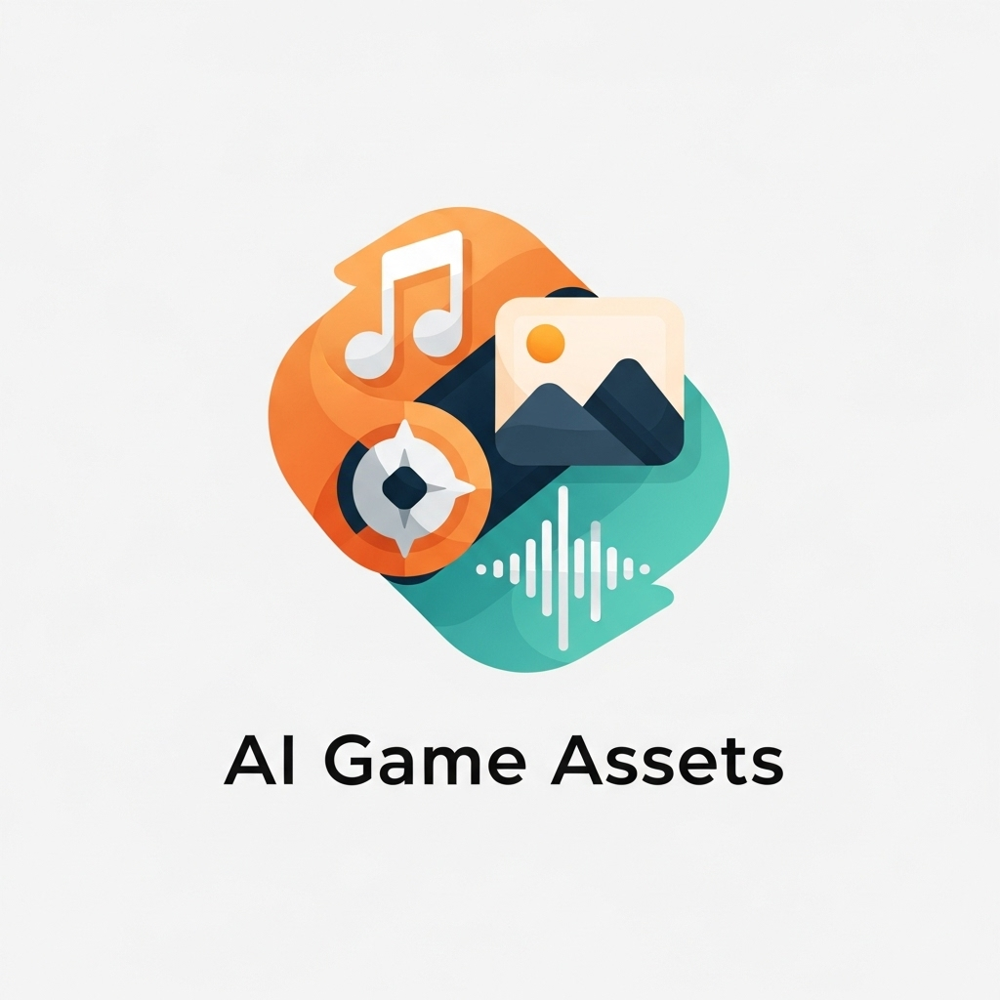

# AI Game Assets

<div align="center">
  
  
  **Comprehensive AI-powered multimedia asset generation for game development**
  
  [](https://badge.fury.io/py/ai-game-assets)
  [](https://www.python.org/downloads/)
  [](https://opensource.org/licenses/MIT)
</div>

## 🎨 What is AI Game Assets?

AI Game Assets is a **standalone multimedia generation library** that creates high-quality audio, visual, and textual assets for game development using cutting-edge AI technologies. Whether you need TTS voice acting, procedural music, Google Fonts integration, or semantic asset enhancement, this library has you covered.

### ✨ Key Features

- **🎵 Comprehensive Audio Generation**: OpenAI TTS with voice selection, procedural music with music21, Freesound API integration
- **🖼️ Smart Visual Assets**: CC0 libraries, Google Fonts integration, Internet Archive seeding
- **🧠 PyTorch-Powered Enhancement**: Semantic similarity, intelligent context enhancement, transformer embeddings
- **⚡ LangChain Tool Integration**: Structured tools for seamless workflow integration
- **🌐 Rich Asset Ecosystem**: Access thousands of free assets with intelligent categorization

## 🏗️ Architecture

```
AI Game Assets Library
├── Audio Generation
│   ├── OpenAI TTS (Multiple voices)
│   ├── music21 Procedural Music
│   ├── Freesound API Integration
│   └── Audio Processing Tools
├── Visual Assets
│   ├── CC0 Libraries Access
│   ├── Google Fonts Integration
│   ├── Internet Archive Seeding
│   └── Image Processing Tools
└── Semantic Enhancement
    ├── PyTorch Embeddings
    ├── Context Analysis
    ├── Similarity Matching
    └── Intelligent Recommendations
```

## 🚀 Quick Start

### Installation

```bash
pip install ai-game-assets
```

### Environment Setup

```bash
export OPENAI_API_KEY="your-openai-api-key"
export FREESOUND_API_KEY="your-freesound-api-key"  # Optional
```

### Basic Audio Generation

```python
from ai_game_assets import AudioTools

# Initialize audio generation
audio = AudioTools()

# Generate TTS dialogue
dialogue = await audio.generate_tts(
    text="Welcome to the mystical realm, brave adventurer!",
    voice="alloy",  # Options: alloy, echo, fable, onyx, nova, shimmer
    speed=1.0
)

# Generate procedural background music
music = await audio.generate_background_music(
    style="orchestral",
    mood="heroic",
    tempo=120,
    duration=180,  # 3 minutes
    key="C major"
)

# Search and download sound effects
sfx = await audio.search_freesound(
    query="sword clang metal",
    duration_max=2.0,
    quality="high"
)
```

### Visual Asset Generation

```python
from ai_game_assets import AssetTools

# Initialize asset generation
assets = AssetTools()

# Access Google Fonts
fonts = await assets.get_google_fonts(
    categories=["serif", "display"],
    languages=["latin", "latin-ext"]
)

# Generate CC0 asset collections
sprites = await assets.generate_cc0_collection(
    theme="medieval fantasy",
    asset_types=["characters", "weapons", "environment"],
    style="pixel art"
)

# Search Internet Archive for reference materials
references = await assets.search_internet_archive(
    keywords=["game sprites", "8bit music"],
    media_types=["image", "audio"],
    license="creative_commons"
)
```

### Advanced Semantic Enhancement

```python
from ai_game_assets import SemanticTools
import torch

# Initialize semantic analysis
semantic = SemanticTools()

# Enhance prompts with contextual seeds
enhanced_prompt = await semantic.enhance_with_context(
    base_prompt="Generate a forest background",
    context_seeds=[
        "dark fantasy atmosphere",
        "twisted ancient trees", 
        "mysterious fog",
        "moonlit clearing"
    ],
    similarity_threshold=0.7
)

# Find semantically similar assets
similar_assets = await semantic.find_similar_assets(
    query_embedding=torch.tensor([...]),  # Your asset embedding
    asset_database="game_sprites_2024",
    top_k=10,
    min_similarity=0.8
)

# Generate contextual asset recommendations
recommendations = await semantic.recommend_assets(
    game_description="Retro space shooter with synthwave aesthetics",
    existing_assets=["neon_ship.png", "laser_sound.wav"],
    asset_types=["background_music", "enemy_sprites", "ui_sounds"]
)
```

## 🎮 Integration Examples

### With Game Engines

```python
# Pygame Integration
import pygame
from ai_game_assets import AudioTools

pygame.mixer.init()
audio = AudioTools()

# Generate and load game audio
bgm = await audio.generate_background_music(style="chiptune")
pygame.mixer.music.load(bgm.file_path)
pygame.mixer.music.play(-1)  # Loop forever
```

```python
# Godot Integration (via export)
from ai_game_assets import AssetTools

assets = AssetTools()

# Generate Godot-compatible assets
textures = await assets.export_for_engine(
    engine="godot",
    asset_type="character_sprites",
    format="png",
    export_path="res://assets/characters/"
)
```

### With AI Game Dev Core

```python
from ai_game_dev import create_game
from ai_game_assets import AudioTools, AssetTools

# Generate game with integrated assets
result = await create_game(
    description="Atmospheric horror game",
    engine="bevy",
    features=["audio", "dynamic_music"]
)

# Generate matching atmospheric assets
audio = AudioTools()
atmospheric_music = await audio.generate_ambient_soundscape(
    mood="tense",
    elements=["wind", "creaking", "distant_sounds"],
    duration=300
)

assets = AssetTools()
horror_sprites = await assets.generate_themed_collection(
    theme="psychological horror",
    style="realistic",
    asset_count=20
)
```

## 🔧 Configuration

### Asset Configuration

```python
from ai_game_assets.config import AssetConfig

config = AssetConfig(
    # Cache settings
    cache_dir="~/.cache/ai_game_assets",
    cache_ttl_hours=24,
    
    # Quality settings
    default_audio_quality="high",
    default_image_resolution="1024x1024",
    
    # API settings
    openai_max_retries=3,
    freesound_rate_limit=100  # requests per hour
)
```

### Custom Audio Processing

```python
from ai_game_assets.audio import AudioProcessor

processor = AudioProcessor()

# Apply game-specific audio effects
processed_audio = await processor.apply_effects(
    audio_file="raw_dialogue.wav",
    effects=[
        {"type": "radio_filter", "intensity": 0.3},
        {"type": "reverb", "room_size": 0.8},
        {"type": "normalize", "target_db": -12}
    ]
)

# Generate adaptive music layers
adaptive_music = await processor.create_adaptive_layers(
    base_track="background_theme.ogg",
    layers={
        "combat": {"instruments": ["drums", "brass"], "intensity": 0.8},
        "exploration": {"instruments": ["strings", "woodwinds"], "intensity": 0.3},
        "boss_fight": {"instruments": ["full_orchestra"], "intensity": 1.0}
    }
)
```

## 🧪 Testing Asset Quality

```python
import pytest
from ai_game_assets import AudioTools, AssetTools

class TestAssetGeneration:
    async def test_tts_generation(self):
        audio = AudioTools()
        result = await audio.generate_tts("Test dialogue")
        
        assert result.duration > 0
        assert result.format == "mp3"
        assert result.quality_score > 0.8
    
    async def test_music_generation(self):
        audio = AudioTools()
        music = await audio.generate_background_music(
            style="ambient",
            duration=30
        )
        
        assert music.tempo > 60
        assert music.key in ["C", "G", "F", "Am", "Em", "Dm"]
        assert len(music.track_layers) >= 3
    
    async def test_semantic_similarity(self):
        semantic = SemanticTools()
        similarity = await semantic.calculate_similarity(
            "medieval castle", 
            "ancient fortress"
        )
        
        assert similarity > 0.7  # Should be highly similar
```

## 📚 Documentation

- **[Audio Generation Guide](docs/audio-generation.md)**: Complete TTS and music workflows
- **[Asset Discovery](docs/asset-discovery.md)**: Finding and using CC0 assets and fonts
- **[Semantic Enhancement](docs/semantic-tools.md)**: PyTorch-powered context understanding
- **[Engine Integration](docs/engine-integration.md)**: Using assets in different game engines
- **[API Reference](docs/api.md)**: Complete function and class documentation

## 🤝 Contributing

We welcome contributions! See our [Contributing Guide](CONTRIBUTING.md) for details.

### Development Setup

```bash
git clone https://github.com/ai-game-dev/ai-game-assets
cd ai-game-assets
uv sync
uv run pytest
```

## 📦 Ecosystem

Part of the **AI Game Development Ecosystem**:

- **[ai-game-dev](https://pypi.org/project/ai-game-dev/)**: Core orchestration library
- **[bevy-ai-game-dev](https://crates.io/crates/bevy-ai-game-dev)**: Native Rust Bevy bindings  
- **[godot-ai-game-dev](https://godotengine.org/asset-library/)**: Godot Asset Library plugin
- **[pygame-ai-game-dev](https://pypi.org/project/pygame-ai-game-dev/)**: Native Pygame bindings
- **[arcade-ai-game-dev](https://pypi.org/project/arcade-ai-game-dev/)**: Native Arcade bindings

## 🎵 Audio Samples

Listen to examples of generated assets:

- **[Orchestral Game Theme](examples/orchestral_theme.ogg)**: Epic fantasy background music
- **[Chiptune Level Music](examples/chiptune_level.ogg)**: Retro 8-bit inspired soundtrack
- **[Character Dialogue](examples/character_dialogue.mp3)**: AI-generated voice acting samples
- **[Ambient Soundscape](examples/forest_ambience.ogg)**: Atmospheric environmental audio

## 📄 License

MIT License - see [LICENSE](LICENSE) for details.

---

<div align="center">
  <strong>Create stunning game assets with the power of AI 🎨🎵✨</strong>
</div>