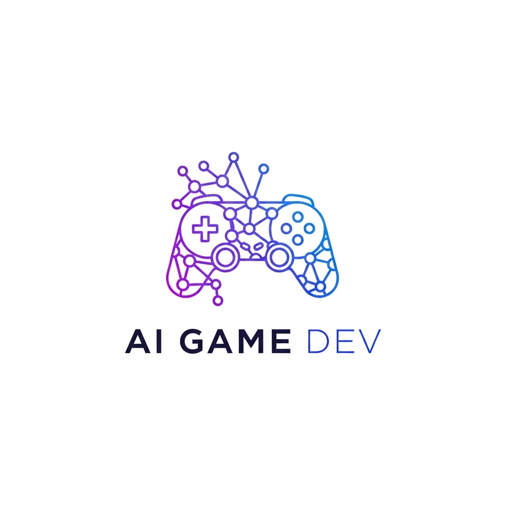

# AI Game Dev

<div align="center">
  
  
  **Revolutionary AI-powered game development with LangGraph orchestration**
  
  [](https://badge.fury.io/py/ai-game-dev)
  [](https://www.python.org/downloads/)
  [](https://opensource.org/licenses/MIT)
</div>

## 🚀 What is AI Game Dev?

AI Game Dev is the **core orchestration library** of the revolutionary AI-powered game development ecosystem. It provides pure LangChain/LangGraph orchestration for multi-agent game development workflows, intelligently routing between specialized engine adapters to generate complete games.

### ✨ Key Features

- **🧠 Multi-Agent Orchestration**: LangGraph-powered workflows with intelligent task routing
- **🔧 Engine-Native Generation**: Produces real Rust (Bevy), GDScript (Godot), Python (Pygame/Arcade) code
- **⚡ Structured Tool Integration**: LangChain-compatible tools for seamless workflow composition
- **💾 Persistent State Management**: SQLite-backed state persistence across development sessions
- **🎯 Universal Format Analysis**: Master any game specification format with intelligent recommendations

## 🏗️ Architecture

```
AI Game Dev Core
├── Multi-Agent LangGraph Orchestration
├── Engine Adapter Management  
├── Workflow Composition & Routing
└── State Management & Persistence
     ↓
Engine-Specific Generation
├── Rust Bevy Projects (bevy-ai-game-dev)
├── GDScript Godot Projects (godot plugin)
├── Python Pygame Projects (pygame-ai-game-dev)
└── Python Arcade Projects (arcade-ai-game-dev)
     ↓
Asset Integration
└── AI Game Assets (ai-game-assets)
    ├── TTS & Music Generation
    ├── Visual Assets & Fonts
    └── PyTorch-Powered Semantic Enhancement
```

## 🚀 Quick Start

### Installation

```bash
pip install ai-game-dev
```

### Basic Usage

```python
from ai_game_dev import AIGameDev, create_game

# Initialize the AI game development system
game_dev = AIGameDev()

# Generate a complete game for Bevy engine
result = await create_game(
    description="A 2D platformer with physics and collectibles",
    engine="bevy",
    complexity="intermediate",
    features=["physics", "audio", "ui"]
)

print(f"Generated {result.engine_type} project:")
print(f"- Main files: {result.main_files}")
print(f"- Assets needed: {result.asset_requirements}")
print(f"- Build with: {result.build_instructions}")
```

### Advanced Multi-Agent Workflow

```python
from ai_game_dev import GameDevelopmentAgent
from ai_game_dev.engine_adapters import EngineAdapterManager

# Create multi-agent workflow
agent = GameDevelopmentAgent()
adapter_manager = EngineAdapterManager()

# Generate for multiple engines simultaneously
engines = ["bevy", "godot", "pygame"]
results = await asyncio.gather(*[
    adapter_manager.generate_for_engine(
        engine_name=engine,
        description="Space shooter with AI enemies",
        complexity="advanced",
        features=["physics", "ai", "audio"]
    )
    for engine in engines
])

for result in results:
    print(f"{result.engine_type} project ready!")
```

## 🎮 Supported Engines

| Engine | Language | Package | Status |
|--------|----------|---------|--------|
| **Bevy** | Rust | `bevy-ai-game-dev` | ✅ Production |
| **Godot** | GDScript | Godot Asset Library | ✅ Production |
| **Pygame** | Python | `pygame-ai-game-dev` | ✅ Production |
| **Arcade** | Python | `arcade-ai-game-dev` | ✅ Production |

## 🧪 Testing Real Bindings

Each generated project is validated for real-world compilation:

```python
# Test Rust Bevy compilation
result = await generate_for_engine("bevy", "Simple 2D game")
assert rust_compiles(result.project_structure)

# Test GDScript parsing
result = await generate_for_engine("godot", "3D adventure game") 
assert gdscript_validates(result.main_files)

# Test Python syntax
result = await generate_for_engine("pygame", "Retro arcade game")
assert python_compiles(result.main_py, result.game_py)
```

## 🎨 Integration with AI Game Assets

Works seamlessly with the multimedia generation library:

```python
from ai_game_dev import create_game
from ai_game_assets import AudioTools, AssetTools

# Generate game with integrated asset creation
result = await create_game(
    description="Fantasy RPG with orchestral music",
    engine="godot",
    features=["audio", "ui"]
)

# Generate matching audio assets
audio_tools = AudioTools()
music = await audio_tools.generate_background_music(
    style="orchestral",
    mood="heroic",
    duration=120
)

# Generate visual assets
asset_tools = AssetTools()
sprites = await asset_tools.generate_character_sprites(
    style="fantasy pixel art",
    characters=["warrior", "mage", "archer"]
)
```

## 📚 Documentation

- **[Getting Started Guide](docs/getting-started.md)**: Complete setup and first game
- **[Engine Adapters](docs/engine-adapters.md)**: Deep dive into engine-specific generation
- **[LangGraph Workflows](docs/workflows.md)**: Understanding the multi-agent orchestration
- **[API Reference](docs/api.md)**: Complete function and class documentation

## 🤝 Contributing

We welcome contributions! See our [Contributing Guide](CONTRIBUTING.md) for details.

### Development Setup

```bash
git clone https://github.com/ai-game-dev/ai-game-dev
cd ai-game-dev
uv sync
uv run pytest
```

## 📦 Ecosystem

Part of the **AI Game Development Ecosystem**:

- **[ai-game-assets](https://pypi.org/project/ai-game-assets/)**: Multimedia generation library
- **[bevy-ai-game-dev](https://crates.io/crates/bevy-ai-game-dev)**: Native Rust Bevy bindings
- **[godot-ai-game-dev](https://godotengine.org/asset-library/)**: Godot Asset Library plugin
- **[pygame-ai-game-dev](https://pypi.org/project/pygame-ai-game-dev/)**: Native Pygame bindings
- **[arcade-ai-game-dev](https://pypi.org/project/arcade-ai-game-dev/)**: Native Arcade bindings

## 📄 License

MIT License - see [LICENSE](LICENSE) for details.

## 🌟 Star History

<a href="https://github.com/ai-game-dev/ai-game-dev/stargazers">
    
</a>

---

<div align="center">
  <strong>Transform your game ideas into reality with the power of AI 🎮✨</strong>
</div>