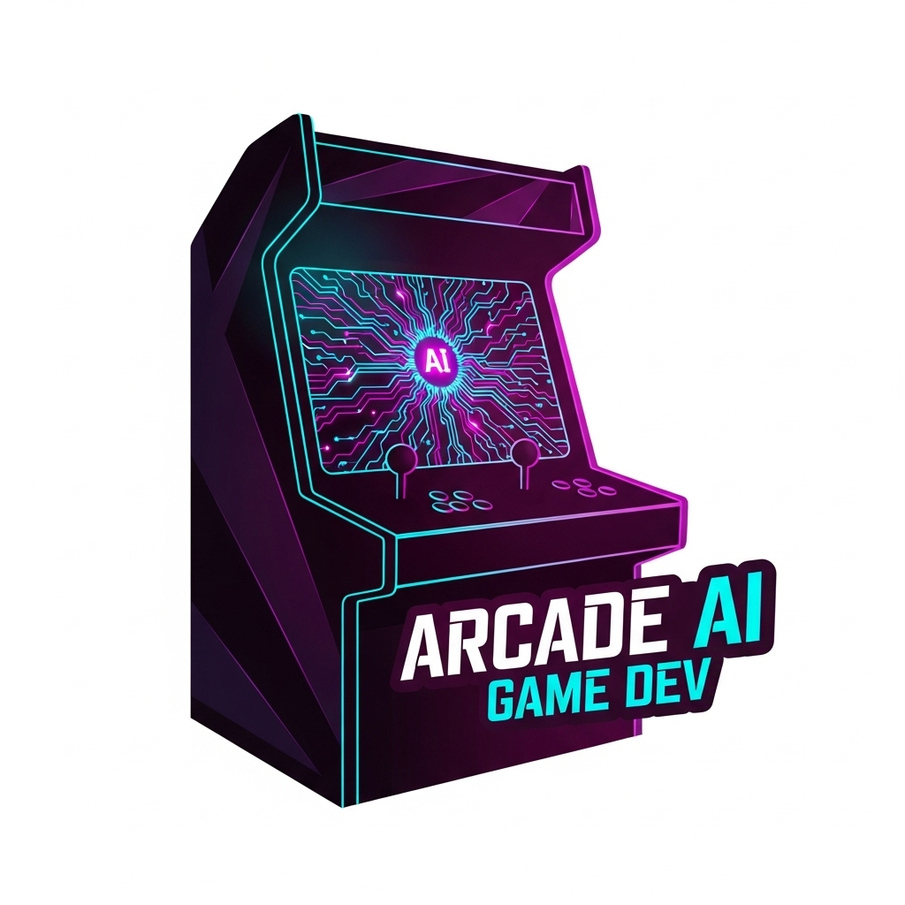

# Arcade AI Game Dev

<div align="center">
  
  
  **Native Arcade game generation bindings for AI game development**
  
  [](https://badge.fury.io/py/arcade-ai-game-dev)
  [](https://www.python.org/downloads/)
  [](https://opensource.org/licenses/MIT)
</div>

## 🎮 What is Arcade AI Game Dev?

Arcade AI Game Dev provides **native Python bindings** for AI-powered game generation specifically designed for the Python Arcade library. Generate complete, high-performance Arcade games with modern OpenGL rendering, advanced physics, and professional game architecture using AI orchestration.

### ✨ Key Features

- **🚀 Modern Arcade Patterns**: Creates proper View classes, sprite lists, and OpenGL rendering
- **🔧 High-Performance Code**: Generated games leverage Arcade's OpenGL acceleration
- **⚡ Contemporary Python**: Uses Python 3.11+ features, async patterns, and type annotations
- **🎯 Professional Templates**: Optimized for modern 2D and 2.5D game development
- **🔗 AI Ecosystem Integration**: Works seamlessly with AI Game Dev orchestration

## 🏗️ Architecture

```
Arcade AI Game Dev
├── Game Specification Analysis
│   ├── Game Type Detection (2D/3D, Platformer, Shooter, etc.)
│   ├── Feature Analysis (Physics, AI, Audio, UI, Shaders)
│   └── Complexity Assessment (Beginner, Intermediate, Advanced)
├── Arcade Project Generation
│   ├── main.py with application setup
│   ├── game_view.py with main view class
│   ├── constants.py with game configuration
│   ├── Optional: physics.py, ai.py, shaders.py
│   └── requirements.txt with dependencies
└── Asset Requirements
    ├── High-res sprite specifications
    ├── Audio requirements (multiple formats)
    └── Shader and texture specifications
```

## 🚀 Quick Start

### Installation

```bash
pip install arcade-ai-game-dev
```

### Basic Usage

```python
from arcade_game_dev import generate_arcade_project, GameSpec, GameType, ComplexityLevel

# Define your game specification
spec = GameSpec(
    name="Neon Cyber Runner",
    description="Fast-paced cyberpunk platformer with neon aesthetics and particle effects",
    game_type=GameType.TWO_DIMENSIONAL,
    features=["physics", "particles", "shaders", "dynamic_lighting"],
    complexity=ComplexityLevel.Advanced
)

# Generate the complete Arcade project
project = generate_arcade_project(spec)

print(f"Generated Arcade project: {spec.name}")
print(f"Main file: {len(project.main_py)} lines")
print(f"View class: {len(project.game_view_py)} lines")
print(f"Required assets: {len(project.assets)} files")

# Write files to disk
with open("main.py", "w") as f:
    f.write(project.main_py)

with open("game_view.py", "w") as f:
    f.write(project.game_view_py)

with open("constants.py", "w") as f:
    f.write(project.constants_py)

with open("requirements.txt", "w") as f:
    f.write(project.requirements_txt)

print("Project generated! Run with: python main.py")
```

### Generated Project Structure

```
my_arcade_game/
├── main.py             # Application entry point
├── game_view.py        # Main game view class
├── constants.py        # Game constants and settings
├── requirements.txt    # Python dependencies
├── views/              # Additional view classes
│   ├── menu_view.py    # Main menu
│   ├── game_over_view.py # Game over screen
│   └── pause_view.py   # Pause screen
├── entities/           # Game entity classes
│   ├── player.py       # Player character
│   ├── enemies.py      # Enemy types
│   └── items.py        # Collectible items
├── assets/
│   ├── images/         # High-resolution sprites
│   ├── sounds/         # Audio files
│   ├── shaders/        # GLSL shader files
│   └── fonts/          # Font files
└── README.md           # Run instructions
```

### Real Arcade Example

```python
# Generated main.py
"""
Neon Cyber Runner - Fast-paced cyberpunk platformer with neon aesthetics
Generated by AI Game Development system using Arcade
"""

import arcade
from game_view import GameView
from constants import *

def main():
    """Main entry point for Neon Cyber Runner."""
    # Create the game window
    window = arcade.Window(SCREEN_WIDTH, SCREEN_HEIGHT, SCREEN_TITLE)
    
    # Create and show the main game view
    game_view = GameView()
    window.show_view(game_view)
    
    # Start the game
    arcade.run()

if __name__ == "__main__":
    main()

# Generated game_view.py
"""
Game view for Neon Cyber Runner
"""

import arcade
import random
from constants import *

class GameView(arcade.View):
    """Main game view for Neon Cyber Runner."""
    
    def __init__(self):
        """Initialize the game view."""
        super().__init__()
        
        # Sprite lists
        self.player_list = None
        self.enemy_list = None
        self.bullet_list = None
        self.item_list = None
        self.particle_list = None
        
        # Player sprite
        self.player_sprite = None
        
        # Physics engine (Pymunk integration)
        self.physics_engine = None
        
        # Game state
        self.score = 0
        self.lives = 3
        self.level = 1
        
        # Visual effects
        self.particle_systems = []
        
        arcade.set_background_color(BACKGROUND_COLOR)
    
    def setup(self):
        """Set up the game and initialize variables."""
        
        # Initialize sprite lists
        self.player_list = arcade.SpriteList()
        self.enemy_list = arcade.SpriteList()
        self.bullet_list = arcade.SpriteList()
        self.item_list = arcade.SpriteList()
        self.particle_list = arcade.SpriteList()
        
        # Set up player
        self.player_sprite = arcade.Sprite(
            ":resources:images/animated_characters/robot/robot_idle.png",
            PLAYER_SCALING
        )
        self.player_sprite.center_x = SCREEN_WIDTH // 4
        self.player_sprite.center_y = SCREEN_HEIGHT // 2
        self.player_list.append(self.player_sprite)
        
        # Set up physics engine
        self.physics_engine = arcade.PymunkPhysicsEngine(
            damping=DAMPING,
            gravity=(0, -GRAVITY)
        )
        self.physics_engine.add_sprite(
            self.player_sprite,
            friction=0.6,
            moment_of_inertia=arcade.PymunkPhysicsEngine.MOMENT_INF
        )
        
        # Generate initial enemies and items
        self.generate_level()
        
        # Initialize particle systems
        self.setup_particle_systems()
    
    def generate_level(self):
        """Generate level content based on current level."""
        # Generate enemies
        for i in range(self.level * 3):
            enemy = arcade.Sprite(
                ":resources:images/animated_characters/zombie/zombie_idle.png",
                ENEMY_SCALING
            )
            enemy.center_x = random.randint(SCREEN_WIDTH, SCREEN_WIDTH * 2)
            enemy.center_y = random.randint(100, SCREEN_HEIGHT - 100)
            enemy.change_x = random.randint(-3, -1)
            self.enemy_list.append(enemy)
        
        # Generate collectible items
        for i in range(self.level * 2):
            item = arcade.Sprite(
                ":resources:images/items/coinGold.png",
                0.3
            )
            item.center_x = random.randint(SCREEN_WIDTH, SCREEN_WIDTH * 3)
            item.center_y = random.randint(100, SCREEN_HEIGHT - 100)
            self.item_list.append(item)
    
    def setup_particle_systems(self):
        """Initialize particle systems for visual effects."""
        # Neon glow particles
        self.neon_particles = arcade.Emitter(
            center_xy=(0, 0),
            emit_controller=arcade.EmitBurst(20),
            particle_factory=lambda emitter: arcade.FadeParticle(
                filename_or_texture=":resources:images/space_shooter/meteorGrey_med1.png",
                change_xy=arcade.rand_in_circle((0, 0), 2),
                lifetime=2.0,
                start_alpha=255,
                end_alpha=0,
                scale=0.2
            )
        )
    
    def on_draw(self):
        """Render the screen."""
        self.clear()
        
        # Draw all sprite lists
        self.player_list.draw()
        self.enemy_list.draw()
        self.bullet_list.draw()
        self.item_list.draw()
        
        # Draw particle effects
        for particle_system in self.particle_systems:
            particle_system.draw()
        
        # Draw UI
        self.draw_ui()
        
        # Apply post-processing effects
        self.apply_screen_effects()
    
    def draw_ui(self):
        """Draw the user interface."""
        # Score
        arcade.draw_text(
            f"Score: {self.score}",
            10, SCREEN_HEIGHT - 30,
            arcade.color.NEON_GREEN,
            font_size=20,
            font_name="Kenney Future"
        )
        
        # Lives
        arcade.draw_text(
            f"Lives: {self.lives}",
            10, SCREEN_HEIGHT - 60,
            arcade.color.NEON_BLUE,
            font_size=20,
            font_name="Kenney Future"
        )
        
        # Level
        arcade.draw_text(
            f"Level: {self.level}",
            SCREEN_WIDTH - 120, SCREEN_HEIGHT - 30,
            arcade.color.NEON_PINK,
            font_size=20,
            font_name="Kenney Future"
        )
    
    def apply_screen_effects(self):
        """Apply post-processing visual effects."""
        # Cyberpunk glow effect
        # This would integrate with custom shaders
        pass
    
    def on_update(self, delta_time):
        """Movement and game logic."""
        
        # Update physics
        self.physics_engine.step()
        
        # Update sprite lists
        self.player_list.update()
        self.enemy_list.update()
        self.bullet_list.update()
        self.item_list.update()
        
        # Update particle systems
        for particle_system in self.particle_systems:
            particle_system.update()
        
        # Game logic
        self.update_game_logic(delta_time)
        
        # Check for level completion
        if len(self.enemy_list) == 0 and len(self.item_list) == 0:
            self.advance_level()
    
    def update_game_logic(self, delta_time):
        """Update game-specific logic."""
        # Collision detection
        item_hits = arcade.check_for_collision_with_list(
            self.player_sprite, self.item_list
        )
        for item in item_hits:
            item.remove_from_sprite_lists()
            self.score += 100
            # Trigger particle effect
            self.create_collection_effect(item.center_x, item.center_y)
        
        # Enemy collisions
        enemy_hits = arcade.check_for_collision_with_list(
            self.player_sprite, self.enemy_list
        )
        if enemy_hits:
            self.player_take_damage()
    
    def create_collection_effect(self, x, y):
        """Create particle effect for item collection."""
        self.neon_particles.center_x = x
        self.neon_particles.center_y = y
        self.neon_particles.emit()
    
    def player_take_damage(self):
        """Handle player taking damage."""
        self.lives -= 1
        if self.lives <= 0:
            self.game_over()
        else:
            # Reset player position
            self.player_sprite.center_x = SCREEN_WIDTH // 4
            self.player_sprite.center_y = SCREEN_HEIGHT // 2
    
    def advance_level(self):
        """Advance to the next level."""
        self.level += 1
        self.generate_level()
    
    def game_over(self):
        """Handle game over."""
        # Switch to game over view
        game_over_view = GameOverView(self.score)
        self.window.show_view(game_over_view)
    
    def on_key_press(self, key, modifiers):
        """Handle key press events."""
        if key == arcade.key.UP or key == arcade.key.W:
            # Jump
            force = (0, JUMP_FORCE)
            self.physics_engine.apply_force(self.player_sprite, force)
        elif key == arcade.key.LEFT or key == arcade.key.A:
            force = (-MOVEMENT_FORCE, 0)
            self.physics_engine.apply_force(self.player_sprite, force)
        elif key == arcade.key.RIGHT or key == arcade.key.D:
            force = (MOVEMENT_FORCE, 0)
            self.physics_engine.apply_force(self.player_sprite, force)
        elif key == arcade.key.SPACE:
            self.shoot_bullet()
    
    def shoot_bullet(self):
        """Create a bullet sprite."""
        bullet = arcade.Sprite(
            ":resources:images/space_shooter/laserBlue01.png",
            0.5
        )
        bullet.center_x = self.player_sprite.center_x + 20
        bullet.center_y = self.player_sprite.center_y
        bullet.change_x = BULLET_SPEED
        self.bullet_list.append(bullet)
```

## 🎮 Supported Game Types

| Game Type | Features | Generated Components |
|-----------|----------|---------------------|
| **Cyberpunk Platformer** | Shaders, Particles, Physics | Neon effects, Advanced movement, Visual polish |
| **Space Shooter** | High-performance sprites, Bullets | Optimized rendering, Particle systems, Audio |
| **Tower Defense** | Path finding, Strategy AI | Grid systems, AI opponents, Resource management |
| **Racing Game** | Vehicle physics, Shaders | Car handling, Track rendering, Performance HUD |
| **RPG** | Complex UI, Save system | Inventory, Stats, Dialogue, Persistence |

## 🔧 Advanced Features

### Custom Shaders Integration

```python
# Generated shader-enabled game
import arcade

class ShaderGameView(arcade.View):
    def __init__(self):
        super().__init__()
        
        # Load custom shaders
        self.glow_shader = self.window.ctx.load_program(
            vertex_shader="shaders/vertex.glsl",
            fragment_shader="shaders/glow_fragment.glsl"
        )
        
        self.distortion_shader = self.window.ctx.load_program(
            vertex_shader="shaders/vertex.glsl", 
            fragment_shader="shaders/distortion_fragment.glsl"
        )
    
    def on_draw(self):
        """Render with custom shaders."""
        # Enable glow shader for neon effects
        with self.glow_shader:
            self.neon_sprites.draw()
        
        # Apply screen distortion
        with self.distortion_shader:
            self.background_list.draw()
```

### High-Performance Physics

```python
# Generated advanced physics game
import arcade
import pymunk

class PhysicsGameView(arcade.View):
    def setup(self):
        """Set up advanced physics simulation."""
        
        # Create physics space with advanced properties
        self.physics_engine = arcade.PymunkPhysicsEngine(
            damping=0.01,
            gravity=(0, -981)  # Realistic gravity
        )
        
        # Add advanced physics bodies
        self.physics_engine.add_sprite(
            self.player_sprite,
            friction=0.7,
            elasticity=0.2,
            body_type=arcade.PymunkPhysicsEngine.DYNAMIC,
            collision_type="player"
        )
        
        # Set up collision handlers
        self.physics_engine.add_collision_handler(
            "player", "enemy", self.player_enemy_collision
        )
    
    def player_enemy_collision(self, player_sprite, enemy_sprite, arbiter, space, data):
        """Handle advanced collision response."""
        # Calculate impact force
        impulse = arbiter.total_impulse
        if impulse.length > 500:
            # High impact collision
            self.create_impact_effect(player_sprite.center_x, player_sprite.center_y)
        
        return True
```

## 🧪 Testing Generated Projects

```python
import pytest
import arcade
from arcade_game_dev import generate_arcade_project, GameSpec, GameType, ComplexityLevel

class TestArcadeGeneration:
    def test_advanced_game_generation(self):
        spec = GameSpec(
            name="Test Game",
            description="Advanced test game",
            game_type=GameType.TWO_DIMENSIONAL,
            features=["physics", "shaders", "particles"],
            complexity=ComplexityLevel.Advanced
        )
        
        project = generate_arcade_project(spec)
        
        # Test advanced features
        assert "pymunk" in project.requirements_txt
        assert "shader" in project.game_view_py.lower()
        assert "particle" in project.game_view_py.lower()
    
    def test_performance_optimization(self):
        spec = GameSpec(
            name="Performance Test",
            description="High-performance game test",
            game_type=GameType.TWO_DIMENSIONAL,
            features=["optimized_rendering", "sprite_batching"],
            complexity=ComplexityLevel.Advanced
        )
        
        project = generate_arcade_project(spec)
        
        # Test performance optimizations
        assert "SpriteList" in project.game_view_py
        assert "use_spatial_hash" in project.game_view_py
    
    def test_modern_python_features(self):
        spec = GameSpec(
            name="Modern Python Test",
            description="Test modern Python patterns",
            game_type=GameType.TWO_DIMENSIONAL,
            features=["async_loading", "type_hints"],
            complexity=ComplexityLevel.Intermediate
        )
        
        project = generate_arcade_project(spec)
        
        # Test modern Python usage
        assert "async def" in project.game_view_py
        assert "from typing import" in project.game_view_py
```

## 📚 Documentation

- **[Getting Started](docs/getting-started.md)**: Complete setup and first Arcade game generation
- **[View Architecture](docs/view-architecture.md)**: Understanding Arcade's view system
- **[Performance Optimization](docs/performance.md)**: Making games run smoothly
- **[Shader Programming](docs/shaders.md)**: Custom visual effects with OpenGL
- **[Physics Integration](docs/physics.md)**: Advanced Pymunk physics usage

## 🤝 Contributing

We welcome contributions! See our [Contributing Guide](CONTRIBUTING.md) for details.

### Development Setup

```bash
git clone https://github.com/ai-game-dev/arcade-ai-game-dev
cd arcade-ai-game-dev
pip install -e .
pytest
```

## 📦 Ecosystem

Part of the **AI Game Development Ecosystem**:

- **[ai-game-dev](https://pypi.org/project/ai-game-dev/)**: Core orchestration library
- **[ai-game-assets](https://pypi.org/project/ai-game-assets/)**: Multimedia generation library
- **[bevy-ai-game-dev](https://crates.io/crates/bevy-ai-game-dev)**: Native Rust Bevy bindings
- **[godot-ai-game-dev](https://godotengine.org/asset-library/)**: Godot Asset Library plugin
- **[pygame-ai-game-dev](https://pypi.org/project/pygame-ai-game-dev/)**: Native Pygame bindings

## 🎮 Example Games

Generated example projects available in the [examples](examples/) directory:

- **[Cyber Runner](examples/cyber_runner/)**: High-speed cyberpunk platformer with shaders
- **[Space Odyssey](examples/space_odyssey/)**: Modern space shooter with particle effects
- **[Neon Defense](examples/neon_defense/)**: Tower defense with dynamic lighting
- **[Quantum Racer](examples/quantum_racer/)**: Physics-based racing with visual effects

Each example includes:
- Complete source code with modern Arcade patterns
- Custom shaders and visual effects
- Performance optimization techniques
- Professional game architecture

## 🚀 Performance Features

Arcade AI Game Dev specializes in high-performance modern game development:

- **OpenGL Acceleration**: Hardware-accelerated rendering for smooth 60+ FPS
- **Sprite Batching**: Efficient rendering of thousands of sprites
- **Custom Shaders**: GLSL shader support for advanced visual effects
- **Spatial Hashing**: Optimized collision detection for large numbers of objects
- **Async Asset Loading**: Non-blocking asset loading for seamless gameplay

## 📄 License

MIT License - see [LICENSE](LICENSE) for details.

---

<div align="center">
  <strong>Create stunning modern games with AI-powered Arcade development 🎮✨</strong>
</div>