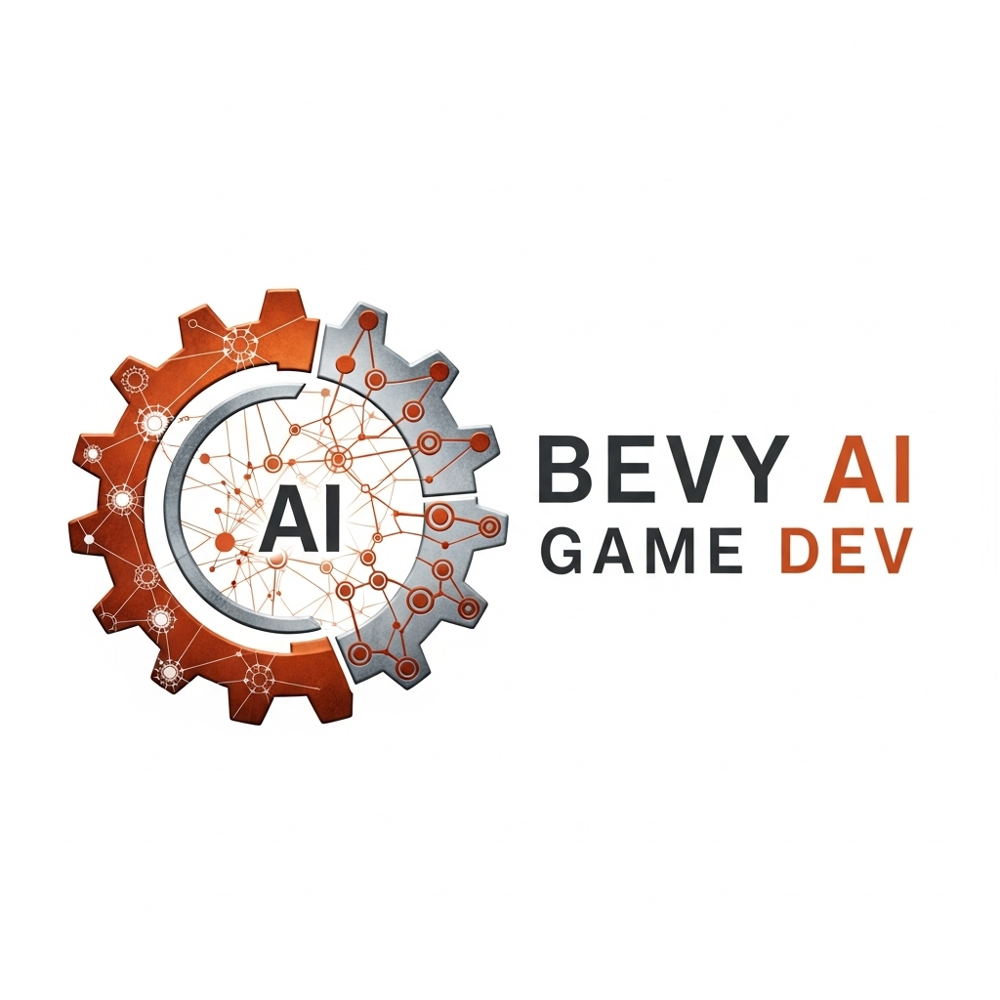

# Bevy AI Game Dev

<div align="center">
  
  
  **Native Rust Bevy game development bindings for AI-powered game generation**
  
  [](https://crates.io/crates/bevy-ai-game-dev)
  [](https://www.rust-lang.org)
  [](https://opensource.org/licenses/MIT)
  [](https://docs.rs/bevy-ai-game-dev)
</div>

## 🦀 What is Bevy AI Game Dev?

Bevy AI Game Dev provides **native Rust bindings** for AI-powered game generation specifically designed for the Bevy game engine. Generate complete, compilable Bevy projects with proper ECS architecture, systems, components, and assets using advanced AI orchestration.

### ✨ Key Features

- **🎮 Native Bevy ECS Generation**: Creates proper Components, Systems, and Resources
- **🔧 Real Rust Compilation**: Generated code compiles with `cargo build`
- **⚡ Modern Bevy Patterns**: Uses Bevy 0.14+ best practices and patterns
- **🎯 Game-Specific Templates**: Optimized for different game genres and complexity levels
- **🔗 AI Ecosystem Integration**: Works seamlessly with AI Game Dev orchestration

## 🏗️ Architecture

```
Bevy AI Game Dev
├── Game Specification Analysis
│   ├── Genre Detection (2D/3D, Platformer, Shooter, etc.)
│   ├── Feature Analysis (Physics, AI, Audio, UI)
│   └── Complexity Assessment (Beginner, Intermediate, Advanced)
├── Bevy Project Generation
│   ├── Cargo.toml with proper dependencies
│   ├── Main.rs with App setup and plugins
│   ├── Components.rs with ECS components
│   ├── Systems.rs with game logic systems
│   └── Resources.rs with global game state
└── Asset Requirements
    ├── Sprite/Model specifications
    ├── Audio asset requirements
    └── Font and UI asset needs
```

## 🚀 Quick Start

### Installation

Add to your `Cargo.toml`:

```toml
[dependencies]
bevy-ai-game-dev = "0.1.0"
bevy = "0.14"
```

### Basic Usage

```rust
use bevy_ai_game_dev::{GameSpec, GameType, ComplexityLevel, generate_bevy_project};

#[tokio::main]
async fn main() -> Result<(), Box<dyn std::error::Error>> {
    // Define your game specification
    let spec = GameSpec {
        name: "Space Adventure".to_string(),
        description: "A 2D space shooter with physics and power-ups".to_string(),
        game_type: GameType::TwoDimensional,
        features: vec![
            "physics".to_string(),
            "audio".to_string(),
            "ui".to_string(),
            "particle_effects".to_string()
        ],
        complexity: ComplexityLevel::Intermediate,
    };

    // Generate the complete Bevy project
    let project = generate_bevy_project(&spec)?;
    
    println!("Generated Bevy project for: {}", spec.name);
    println!("Cargo.toml:\n{}", project.cargo_toml);
    println!("Main.rs:\n{}", project.main_rs);
    
    // Write files to disk
    std::fs::write("Cargo.toml", project.cargo_toml)?;
    std::fs::write("src/main.rs", project.main_rs)?;
    
    // Write component and system files
    for (i, component) in project.components.iter().enumerate() {
        std::fs::write(format!("src/components_{}.rs", i), component)?;
    }
    
    Ok(())
}
```

### Generated Project Structure

```
my_bevy_game/
├── Cargo.toml          # Dependencies and project config
├── src/
│   ├── main.rs         # App setup with plugins and systems
│   ├── components.rs   # ECS components (Player, Enemy, etc.)
│   ├── systems.rs      # Game logic systems
│   ├── resources.rs    # Global game state
│   └── events.rs       # Custom game events
├── assets/
│   ├── textures/       # Sprite and texture files
│   ├── sounds/         # Audio files
│   └── fonts/          # Font files
└── README.md           # Build and run instructions
```

### Real Bevy ECS Example

```rust
// Generated components.rs
use bevy::prelude::*;

#[derive(Component)]
pub struct Player {
    pub speed: f32,
    pub health: i32,
}

#[derive(Component)]
pub struct Enemy {
    pub damage: i32,
    pub patrol_distance: f32,
}

#[derive(Component)]
pub struct Physics {
    pub velocity: Vec2,
    pub acceleration: Vec2,
}

// Generated systems.rs
use bevy::prelude::*;
use crate::components::*;

pub fn player_movement_system(
    keyboard_input: Res<Input<KeyCode>>,
    mut query: Query<(&mut Transform, &Player)>,
    time: Res<Time>,
) {
    for (mut transform, player) in &mut query {
        let mut direction = Vec3::ZERO;
        
        if keyboard_input.pressed(KeyCode::W) {
            direction.y += 1.0;
        }
        if keyboard_input.pressed(KeyCode::S) {
            direction.y -= 1.0;
        }
        if keyboard_input.pressed(KeyCode::A) {
            direction.x -= 1.0;
        }
        if keyboard_input.pressed(KeyCode::D) {
            direction.x += 1.0;
        }
        
        if direction.length() > 0.0 {
            direction = direction.normalize();
            transform.translation += direction * player.speed * time.delta_seconds();
        }
    }
}

pub fn enemy_ai_system(
    mut enemy_query: Query<(&mut Transform, &Enemy), Without<Player>>,
    player_query: Query<&Transform, (With<Player>, Without<Enemy>)>,
    time: Res<Time>,
) {
    let Ok(player_transform) = player_query.get_single() else { return; };
    
    for (mut enemy_transform, enemy) in &mut enemy_query {
        let direction = (player_transform.translation - enemy_transform.translation).normalize();
        enemy_transform.translation += direction * 50.0 * time.delta_seconds();
    }
}
```

## 🎮 Supported Game Types

| Game Type | Features | Generated Systems |
|-----------|----------|-------------------|
| **2D Platformer** | Physics, Collectibles | Movement, Collision, Item Collection |
| **Top-Down Shooter** | Combat, AI Enemies | Shooting, Enemy AI, Health |
| **Puzzle Game** | UI, State Management | Puzzle Logic, UI Updates, Win Conditions |
| **Racing Game** | Physics, Checkpoints | Vehicle Physics, Lap Timing, Checkpoint |
| **RPG** | Stats, Inventory, Dialogue | Character Stats, Item Management, NPC Interaction |

## 🔧 Advanced Configuration

### Custom Feature Generation

```rust
use bevy_ai_game_dev::{GameSpec, FeatureConfig};

let spec = GameSpec {
    name: "Advanced RPG".to_string(),
    description: "Complex RPG with magic system".to_string(),
    game_type: GameType::TwoDimensional,
    features: vec![
        "advanced_physics".to_string(),
        "magic_system".to_string(),
        "inventory_management".to_string(),
        "dialogue_trees".to_string(),
        "save_system".to_string()
    ],
    complexity: ComplexityLevel::Advanced,
};

// Configure specific feature implementations
let feature_config = FeatureConfig::new()
    .with_physics_engine("rapier")  // Use Rapier for physics
    .with_audio_backend("kira")     // Use Kira for audio
    .with_ui_framework("bevy_egui") // Use egui for UI
    .with_save_format("ron");       // Use RON for save files

let project = generate_bevy_project_with_config(&spec, &feature_config)?;
```

### Integration with Asset Generation

```rust
use bevy_ai_game_dev::{generate_bevy_project, GameSpec};
// Assuming integration with ai-game-assets Python library via FFI

#[tokio::main]
async fn main() -> Result<(), Box<dyn std::error::Error>> {
    let spec = GameSpec {
        name: "Atmospheric Adventure".to_string(),
        description: "Mysterious exploration game with dynamic audio".to_string(),
        game_type: GameType::TwoDimensional,
        features: vec!["audio".to_string(), "dynamic_music".to_string()],
        complexity: ComplexityLevel::Intermediate,
    };

    // Generate Bevy project
    let project = generate_bevy_project(&spec)?;
    
    // Generate matching assets (requires ai-game-assets integration)
    let audio_requirements = project.assets.iter()
        .filter(|asset| asset.ends_with(".ogg") || asset.ends_with(".wav"))
        .collect::<Vec<_>>();
    
    println!("Generated Bevy project with {} audio requirements", audio_requirements.len());
    
    // Write the project files
    write_project_to_disk(&project, "./generated_game")?;
    
    Ok(())
}
```

## 🧪 Testing Generated Projects

```rust
#[cfg(test)]
mod tests {
    use super::*;
    use std::process::Command;

    #[test]
    fn test_generated_project_compiles() {
        let spec = GameSpec {
            name: "Test Game".to_string(),
            description: "Simple test game".to_string(),
            game_type: GameType::TwoDimensional,
            features: vec!["physics".to_string()],
            complexity: ComplexityLevel::Beginner,
        };

        let project = generate_bevy_project(&spec).unwrap();
        
        // Write to temporary directory
        let temp_dir = tempfile::tempdir().unwrap();
        write_project_to_disk(&project, temp_dir.path()).unwrap();
        
        // Test compilation
        let output = Command::new("cargo")
            .args(&["check"])
            .current_dir(temp_dir.path())
            .output()
            .unwrap();
        
        assert!(output.status.success(), "Generated project should compile");
    }

    #[test]
    fn test_ecs_components_are_valid() {
        let spec = GameSpec {
            name: "ECS Test".to_string(),
            description: "Test ECS component generation".to_string(),
            game_type: GameType::TwoDimensional,
            features: vec!["physics".to_string(), "ai".to_string()],
            complexity: ComplexityLevel::Intermediate,
        };

        let project = generate_bevy_project(&spec).unwrap();
        
        // Verify components contain expected ECS patterns
        assert!(project.components.iter().any(|c| c.contains("#[derive(Component)]")));
        assert!(project.systems.iter().any(|s| s.contains("Query<")));
    }
}
```

## 📚 Documentation

- **[Getting Started](docs/getting-started.md)**: Complete setup and first Bevy game generation
- **[ECS Patterns](docs/ecs-patterns.md)**: Understanding generated Bevy ECS architecture
- **[Asset Integration](docs/asset-integration.md)**: Working with generated asset requirements
- **[Advanced Features](docs/advanced-features.md)**: Custom systems and complex game logic
- **[API Reference](https://docs.rs/bevy-ai-game-dev)**: Complete Rust documentation

## 🤝 Contributing

We welcome contributions! See our [Contributing Guide](CONTRIBUTING.md) for details.

### Development Setup

```bash
git clone https://github.com/ai-game-dev/bevy-ai-game-dev
cd bevy-ai-game-dev
cargo build
cargo test
```

## 📦 Ecosystem

Part of the **AI Game Development Ecosystem**:

- **[ai-game-dev](https://pypi.org/project/ai-game-dev/)**: Core orchestration library (Python)
- **[ai-game-assets](https://pypi.org/project/ai-game-assets/)**: Multimedia generation library (Python)
- **[godot-ai-game-dev](https://godotengine.org/asset-library/)**: Godot Asset Library plugin (GDScript)
- **[pygame-ai-game-dev](https://pypi.org/project/pygame-ai-game-dev/)**: Native Pygame bindings (Python)
- **[arcade-ai-game-dev](https://pypi.org/project/arcade-ai-game-dev/)**: Native Arcade bindings (Python)

## 🎮 Example Games

Generated example projects available in the [examples](examples/) directory:

- **[Space Shooter](examples/space_shooter/)**: 2D physics-based space combat
- **[Platformer](examples/platformer/)**: Classic 2D platformer with collectibles
- **[Tower Defense](examples/tower_defense/)**: Strategic tower placement and enemy waves
- **[Racing Game](examples/racing/)**: 2D top-down racing with lap timing

Each example includes:
- Complete source code
- Asset specifications
- Build instructions
- Gameplay screenshots

## 📄 License

MIT License - see [LICENSE](LICENSE) for details.

---

<div align="center">
  <strong>Build amazing Bevy games with the power of AI and Rust 🦀🎮✨</strong>
</div>