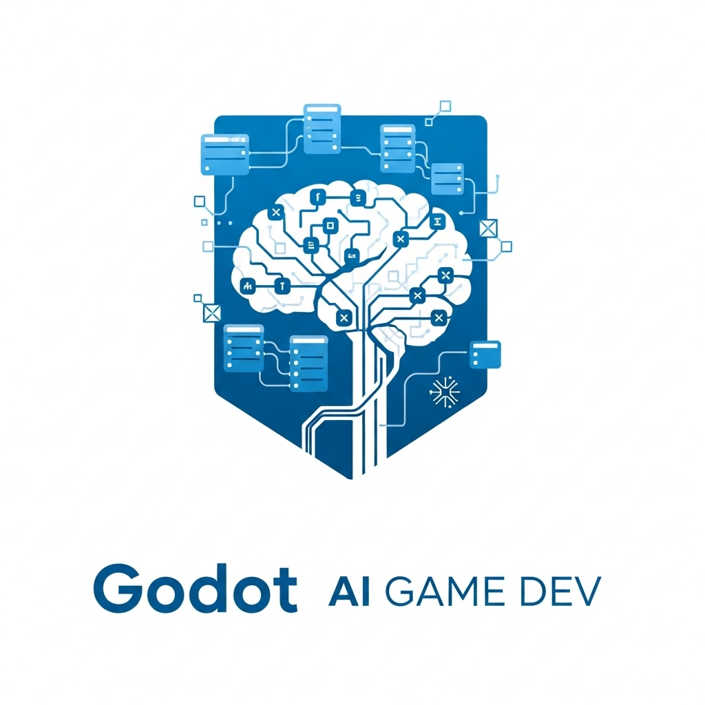

# Godot AI Game Dev

<div align="center">
  
  
  **Native GDScript game generation plugin for Godot Engine with AI-powered development**
  
  [](https://godotengine.org/asset-library/)
  [](https://godotengine.org)
  [](https://opensource.org/licenses/MIT)
</div>

## 🎮 What is Godot AI Game Dev?

Godot AI Game Dev is a **native Godot plugin** that brings AI-powered game generation directly into the Godot Engine editor. Generate complete games, scenes, scripts, and assets using advanced AI orchestration, all while staying within your familiar Godot workflow.

### ✨ Key Features

- **🏗️ Native GDScript Generation**: Creates proper Godot scenes, scripts, and project structure
- **🎭 Scene-Based Architecture**: Generates node trees, scene files, and script attachments
- **⚡ Real-Time Editor Integration**: Works directly within Godot Engine editor
- **🎯 Genre-Specific Templates**: Optimized for different game types and complexity levels
- **🔗 AI Ecosystem Integration**: Connects with AI Game Assets for multimedia generation

## 🏗️ Architecture

```
Godot AI Game Dev Plugin
├── Editor Integration
│   ├── Game Generator Dock
│   ├── Asset Import Pipeline
│   └── Scene Template Manager
├── GDScript Generation
│   ├── Main Scene Controller
│   ├── Player/Character Scripts
│   ├── Game Manager Scripts
│   └── UI/Menu Scripts
├── Scene Structure Creation
│   ├── Node Tree Generation
│   ├── Scene File Creation
│   └── Script Attachment
└── Asset Requirements
    ├── Texture Specifications
    ├── Audio Asset Needs
    └── Font/UI Requirements
```

## 🚀 Quick Start

### Installation

#### From Godot Asset Library
1. Open Godot Engine
2. Go to **AssetLib** tab
3. Search for "AI Game Development Generator"
4. Click **Download** and **Install**
5. Enable the plugin in **Project Settings > Plugins**

#### Manual Installation
1. Download the latest release from [GitHub](https://github.com/ai-game-dev/godot-ai-game-dev)
2. Extract to your project's `addons/` folder
3. Enable in **Project Settings > Plugins**

### Basic Usage

1. **Open the AI Game Generator Dock** (appears in the editor sidebar)
2. **Describe your game** in the text field
3. **Select game type**: 2D or 3D
4. **Choose complexity**: Beginner, Intermediate, or Advanced
5. **Select features**: Physics, AI, Audio, UI, etc.
6. **Click "Generate Game"**

#### Example Generation

```
Game Description: "A 2D platformer where the player collects gems while avoiding enemies"
Game Type: 2D
Complexity: Intermediate
Features: [Physics, Audio, UI, Collectibles]

Generated Output:
- Main.tscn (main scene with player and level)
- Player.gd (character controller script)
- Enemy.gd (AI enemy behavior)
- GameManager.gd (score, lives, game state)
- UI.tscn (HUD with score and health)
```

### Generated Project Structure

```
your_game_project/
├── scenes/
│   ├── Main.tscn           # Main game scene
│   ├── Player.tscn         # Player character scene
│   ├── Enemy.tscn          # Enemy character scene
│   ├── UI/
│   │   ├── HUD.tscn        # Game HUD
│   │   └── MainMenu.tscn   # Main menu
│   └── Levels/
│       └── Level1.tscn     # Game levels
├── scripts/
│   ├── Main.gd             # Main game controller
│   ├── Player.gd           # Player movement and actions
│   ├── Enemy.gd            # Enemy AI behavior
│   ├── GameManager.gd      # Global game state
│   └── UI/
│       ├── HUD.gd          # HUD updates
│       └── MainMenu.gd     # Menu navigation
├── assets/
│   ├── textures/           # Sprite requirements
│   ├── sounds/             # Audio requirements
│   └── fonts/              # Font requirements
└── project.godot           # Godot project configuration
```

## 🎮 Real GDScript Examples

### Generated Player Controller

```gdscript
# Player.gd - Generated player controller
extends CharacterBody2D

@export var speed: float = 300.0
@export var jump_velocity: float = -400.0

# Get the gravity from the project settings to be synced with RigidBody nodes
var gravity = ProjectSettings.get_setting("physics/2d/default_gravity")

func _ready():
    print("Player initialized for: Amazing Platformer Adventure")

func _physics_process(delta):
    # Add gravity
    if not is_on_floor():
        velocity.y += gravity * delta

    # Handle jump
    if Input.is_action_just_pressed("ui_accept") and is_on_floor():
        velocity.y = jump_velocity

    # Handle movement
    var direction = Input.get_axis("ui_left", "ui_right")
    if direction:
        velocity.x = direction * speed
    else:
        velocity.x = move_toward(velocity.x, 0, speed)

    move_and_slide()

func collect_gem():
    GameManager.add_score(10)
    print("Gem collected!")

func take_damage():
    GameManager.lose_life()
    print("Player took damage!")
```

### Generated Enemy AI

```gdscript
# Enemy.gd - Generated enemy AI behavior
extends CharacterBody2D

@export var patrol_speed: float = 50.0
@export var chase_speed: float = 100.0
@export var detection_range: float = 150.0
@export var patrol_distance: float = 200.0

var player: CharacterBody2D
var start_position: Vector2
var patrol_direction: int = 1

enum State { PATROL, CHASE, ATTACK }
var current_state: State = State.PATROL

func _ready():
    start_position = global_position
    player = get_tree().get_first_node_in_group("player")

func _physics_process(delta):
    match current_state:
        State.PATROL:
            patrol_behavior(delta)
        State.CHASE:
            chase_behavior(delta)
        State.ATTACK:
            attack_behavior(delta)
    
    move_and_slide()

func patrol_behavior(delta):
    velocity.x = patrol_direction * patrol_speed
    
    # Check patrol bounds
    if abs(global_position.x - start_position.x) > patrol_distance:
        patrol_direction *= -1
    
    # Check for player
    if player and global_position.distance_to(player.global_position) < detection_range:
        current_state = State.CHASE

func chase_behavior(delta):
    if player:
        var direction = (player.global_position - global_position).normalized()
        velocity.x = direction.x * chase_speed
        
        # Lost player
        if global_position.distance_to(player.global_position) > detection_range * 1.5:
            current_state = State.PATROL

func attack_behavior(delta):
    # Attack logic here
    pass
```

### Generated Game Manager

```gdscript
# GameManager.gd - Generated global game state
extends Node

signal score_changed(new_score)
signal lives_changed(new_lives)
signal game_over

var score: int = 0
var lives: int = 3
var level: int = 1
var game_paused: bool = false

func _ready():
    # Connect to scene tree events
    get_tree().paused = false

func add_score(points: int):
    score += points
    score_changed.emit(score)
    print("Score: ", score)

func lose_life():
    lives -= 1
    lives_changed.emit(lives)
    
    if lives <= 0:
        trigger_game_over()
    else:
        respawn_player()

func trigger_game_over():
    game_over.emit()
    print("Game Over! Final Score: ", score)
    
func respawn_player():
    # Respawn logic
    var player = get_tree().get_first_node_in_group("player")
    if player:
        player.global_position = Vector2(100, 100)  # Spawn point

func pause_game():
    game_paused = !game_paused
    get_tree().paused = game_paused

func restart_game():
    score = 0
    lives = 3
    level = 1
    get_tree().reload_current_scene()
```

## 🔧 Advanced Features

### Custom Game Generation

The plugin provides advanced options for experienced developers:

```gdscript
# Access the GameGenerator class directly
var generator = GameGenerator.new()

var spec = GameGenerator.GameSpec.new()
spec.name = "Advanced RPG"
spec.description = "Complex RPG with magic and inventory systems"
spec.game_type = GameGenerator.GameType.TWO_DIMENSIONAL
spec.features = ["advanced_ai", "magic_system", "inventory", "dialogue"]
spec.complexity = GameGenerator.ComplexityLevel.ADVANCED

var project = GameGenerator.generate_godot_project(spec)

# Access generated files
print("Generated scripts: ", project.scripts.keys())
print("Generated scenes: ", project.scenes.keys())
print("Required assets: ", project.assets)
```

### Integration with External Assets

```gdscript
# Connect with AI Game Assets for multimedia
# (Requires Python integration via HTTP API or subprocess)

func generate_game_with_assets():
    var spec = create_game_spec()
    var project = GameGenerator.generate_godot_project(spec)
    
    # Request matching assets from AI Game Assets
    var asset_request = {
        "game_description": spec.description,
        "art_style": "pixel art",
        "audio_style": "chiptune",
        "asset_types": ["sprites", "music", "sfx"]
    }
    
    # This would interface with the Python ai-game-assets library
    request_external_assets(asset_request)
```

## 🎯 Supported Game Types

| Game Type | Generated Features | Example Scenes |
|-----------|-------------------|----------------|
| **2D Platformer** | Physics, Collectibles, Enemies | Player, Level, UI, Enemy |
| **Top-Down Adventure** | Movement, Inventory, NPCs | Player, World, NPCs, UI |
| **Puzzle Game** | Grid System, Win Conditions | Grid, Pieces, UI, Menu |
| **Racing Game** | Vehicle Physics, Checkpoints | Car, Track, HUD, Finish |
| **RPG** | Stats, Combat, Dialogue | Player, NPCs, Combat, Inventory |

## 🧪 Testing Generated Games

The plugin includes validation for all generated GDScript:

```gdscript
# Built-in validation system
func test_generated_game():
    var spec = GameGenerator.GameSpec.new()
    spec.name = "Test Game"
    spec.description = "Simple test"
    spec.game_type = GameGenerator.GameType.TWO_DIMENSIONAL
    
    var project = GameGenerator.generate_godot_project(spec)
    
    # Validate GDScript syntax
    for script_name in project.scripts:
        var script_content = project.scripts[script_name]
        assert(GameGenerator.validate_gdscript_syntax(script_content), 
               "Script %s has syntax errors" % script_name)
    
    print("All generated scripts are syntactically valid!")
```

## 📚 Documentation

- **[Getting Started Guide](docs/getting-started.md)**: Complete plugin setup and first game
- **[GDScript Patterns](docs/gdscript-patterns.md)**: Understanding generated code structure
- **[Scene Architecture](docs/scene-architecture.md)**: How scenes and nodes are organized
- **[Asset Integration](docs/asset-integration.md)**: Working with generated asset requirements
- **[Advanced Usage](docs/advanced-usage.md)**: Custom generation and API usage

## 🤝 Contributing

We welcome contributions! See our [Contributing Guide](CONTRIBUTING.md) for details.

### Development Setup

1. Clone the repository
2. Open Godot Engine
3. Import the project
4. Enable the plugin in Project Settings
5. Make changes and test in the editor

## 📦 Ecosystem

Part of the **AI Game Development Ecosystem**:

- **[ai-game-dev](https://pypi.org/project/ai-game-dev/)**: Core orchestration library (Python)
- **[ai-game-assets](https://pypi.org/project/ai-game-assets/)**: Multimedia generation library (Python)
- **[bevy-ai-game-dev](https://crates.io/crates/bevy-ai-game-dev)**: Native Rust Bevy bindings
- **[pygame-ai-game-dev](https://pypi.org/project/pygame-ai-game-dev/)**: Native Pygame bindings (Python)
- **[arcade-ai-game-dev](https://pypi.org/project/arcade-ai-game-dev/)**: Native Arcade bindings (Python)

## 🎮 Example Projects

Generated example projects available in the [examples](examples/) directory:

- **[2D Platformer](examples/platformer/)**: Classic jump-and-run with collectibles
- **[Top-Down Shooter](examples/shooter/)**: Action game with enemies and power-ups
- **[Puzzle Game](examples/puzzle/)**: Logic-based tile matching game
- **[RPG Demo](examples/rpg/)**: Character stats, inventory, and dialogue

Each example includes:
- Complete Godot project files
- Generated scenes and scripts
- Asset requirement specifications
- Gameplay screenshots

## 📺 Video Tutorials

- **[Plugin Installation](videos/installation.mp4)**: Step-by-step setup guide
- **[First Game Generation](videos/first-game.mp4)**: Creating your first AI-generated game
- **[Advanced Features](videos/advanced.mp4)**: Using custom specifications and features
- **[Asset Integration](videos/assets.mp4)**: Working with multimedia assets

## 📄 License

MIT License - see [LICENSE](LICENSE) for details.

---

<div align="center">
  <strong>Create amazing Godot games with the power of AI and GDScript 🎮✨</strong>
</div>