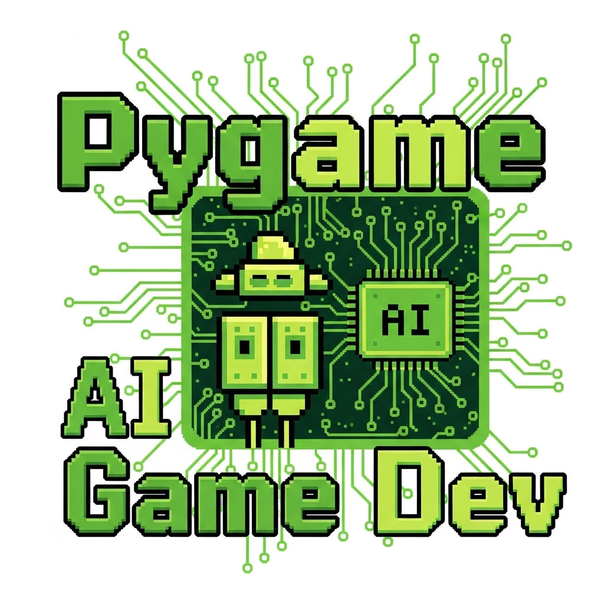

# Pygame AI Game Dev

<div align="center">
  
  
  **Native Pygame game generation bindings for AI game development**
  
  [](https://badge.fury.io/py/pygame-ai-game-dev)
  [](https://www.python.org/downloads/)
  [](https://opensource.org/licenses/MIT)
</div>

## 🐍 What is Pygame AI Game Dev?

Pygame AI Game Dev provides **native Python bindings** for AI-powered game generation specifically designed for Pygame. Generate complete, runnable Pygame projects with proper game architecture, event handling, and sprite management using advanced AI orchestration.

### ✨ Key Features

- **🎮 Classic Pygame Patterns**: Creates proper game loops, event handling, and sprite management
- **🔧 Ready-to-Run Code**: Generated games execute immediately with `python main.py`
- **⚡ Modern Python Practices**: Uses Python 3.11+ features, type hints, and best practices
- **🎯 Retro-Inspired Templates**: Optimized for classic 2D game genres and pixel art aesthetics
- **🔗 AI Ecosystem Integration**: Works seamlessly with AI Game Dev orchestration

## 🏗️ Architecture

```
Pygame AI Game Dev
├── Game Specification Analysis
│   ├── 2D Game Type Detection (Platformer, Shooter, Puzzle, etc.)
│   ├── Feature Analysis (Physics, AI, Audio, UI)
│   └── Complexity Assessment (Beginner, Intermediate, Advanced)
├── Pygame Project Generation
│   ├── main.py with game initialization
│   ├── game.py with main game class and loop
│   ├── player.py with character controller
│   ├── constants.py with game settings
│   └── requirements.txt with dependencies
└── Asset Requirements
    ├── Sprite specifications (PNG format)
    ├── Audio requirements (WAV/OGG format)
    └── Font specifications (TTF format)
```

## 🚀 Quick Start

### Installation

```bash
pip install pygame-ai-game-dev
```

### Basic Usage

```python
from pygame_game_dev import generate_pygame_project, GameSpec, GameType, ComplexityLevel

# Define your game specification
spec = GameSpec(
    name="Retro Space Invaders",
    description="Classic space shooter with pixel art style and power-ups",
    game_type=GameType.TWO_DIMENSIONAL,
    features=["physics", "audio", "particle_effects", "power_ups"],
    complexity=ComplexityLevel.Intermediate
)

# Generate the complete Pygame project
project = generate_pygame_project(spec)

print(f"Generated Pygame project: {spec.name}")
print(f"Main file: {len(project.main_py)} lines")
print(f"Game class: {len(project.game_py)} lines")
print(f"Required assets: {len(project.assets)} files")

# Write files to disk
with open("main.py", "w") as f:
    f.write(project.main_py)

with open("game.py", "w") as f:
    f.write(project.game_py)

with open("player.py", "w") as f:
    f.write(project.player_py)

with open("constants.py", "w") as f:
    f.write(project.constants_py)

with open("requirements.txt", "w") as f:
    f.write(project.requirements_txt)

print("Project generated! Run with: python main.py")
```

### Generated Project Structure

```
my_pygame_game/
├── main.py             # Game entry point and initialization
├── game.py             # Main game class with game loop
├── player.py           # Player character controller
├── constants.py        # Game constants and settings
├── requirements.txt    # Python dependencies
├── assets/
│   ├── sprites/        # Character and object sprites
│   ├── sounds/         # Audio files
│   └── fonts/          # Font files
└── README.md           # Run instructions
```

### Real Pygame Example

```python
# Generated main.py
"""
Retro Space Invaders - Classic space shooter with pixel art style and power-ups
Generated by AI Game Development system
"""

import pygame
import sys
from game import Game

def main():
    """Main entry point for Retro Space Invaders."""
    pygame.init()
    
    try:
        game = Game()
        game.run()
    except Exception as e:
        print(f"Game error: {e}")
    finally:
        pygame.quit()
        sys.exit()

if __name__ == "__main__":
    main()

# Generated game.py
"""
Game class for Retro Space Invaders
"""

import pygame
from constants import *
from player import Player

class Game:
    """Main game class for Retro Space Invaders."""
    
    def __init__(self):
        """Initialize the game."""
        self.screen = pygame.display.set_mode((SCREEN_WIDTH, SCREEN_HEIGHT))
        pygame.display.set_caption("Retro Space Invaders")
        self.clock = pygame.time.Clock()
        self.running = True
        
        # Initialize game features
        pygame.mixer.init()
        self.load_audio()
        
        self.setup_game()
    
    def setup_game(self):
        """Setup game-specific initialization."""
        self.player = Player()
        self.enemies = pygame.sprite.Group()
        self.bullets = pygame.sprite.Group()
        self.power_ups = pygame.sprite.Group()
        
    def run(self):
        """Main game loop."""
        while self.running:
            dt = self.clock.tick(FPS) / 1000.0
            
            self.handle_events()
            self.update(dt)
            self.draw()
    
    def handle_events(self):
        """Handle pygame events."""
        for event in pygame.event.get():
            if event.type == pygame.QUIT:
                self.running = False
            elif event.type == pygame.KEYDOWN:
                if event.key == pygame.K_SPACE:
                    self.player.shoot(self.bullets)
    
    def update(self, dt):
        """Update game logic."""
        self.player.update(dt)
        self.enemies.update(dt)
        self.bullets.update(dt)
        self.power_ups.update(dt)
        
        # Collision detection
        self.check_collisions()
    
    def check_collisions(self):
        """Handle collision detection."""
        # Bullet-enemy collisions
        for bullet in self.bullets:
            hit_enemies = pygame.sprite.spritecollide(bullet, self.enemies, True)
            if hit_enemies:
                bullet.kill()
                # Add score, particle effects, etc.
        
        # Player-enemy collisions
        if pygame.sprite.spritecollide(self.player, self.enemies, False):
            self.player.take_damage()
    
    def draw(self):
        """Render the game."""
        self.screen.fill(BACKGROUND_COLOR)
        
        # Draw all sprites
        self.screen.blit(self.player.image, self.player.rect)
        self.enemies.draw(self.screen)
        self.bullets.draw(self.screen)
        self.power_ups.draw(self.screen)
        
        # Draw UI
        self.draw_hud()
        
        pygame.display.flip()
    
    def draw_hud(self):
        """Draw the heads-up display."""
        # Score, lives, etc.
        pass
    
    def load_audio(self):
        """Load audio assets."""
        # Background music and sound effects
        pass
```

## 🎮 Supported Game Types

| Game Type | Features | Generated Components |
|-----------|----------|---------------------|
| **Space Shooter** | Bullets, Enemies, Power-ups | Player ship, Enemy sprites, Bullet system |
| **Platformer** | Physics, Collectibles | Gravity, Jump mechanics, Item collection |
| **Puzzle Game** | Grid System, Win Logic | Grid management, Piece matching, Win detection |
| **Racing Game** | Vehicle Physics, Checkpoints | Car movement, Track following, Lap timing |
| **Breakout Clone** | Ball Physics, Blocks | Paddle control, Ball bouncing, Block destruction |

## 🔧 Advanced Configuration

### Custom Feature Generation

```python
from pygame_game_dev import generate_pygame_project, GameSpec

# Advanced game with custom features
spec = GameSpec(
    name="Advanced Platformer",
    description="Complex platformer with multiple mechanics",
    game_type=GameType.TWO_DIMENSIONAL,
    features=[
        "advanced_physics",      # Pymunk physics integration
        "particle_systems",      # Visual effects
        "save_system",          # Game state persistence
        "level_editor",         # Built-in level editing
        "achievements",         # Achievement system
        "dynamic_music"         # Adaptive audio
    ],
    complexity=ComplexityLevel.Advanced
)

project = generate_pygame_project(spec)

# Advanced features generate additional files
print("Generated modules:")
for feature in project.optional_modules:
    print(f"- {feature}.py")
```

### Physics Integration

```python
# Generated physics-enabled player class
import pygame
import pymunk
from constants import *

class Player(pygame.sprite.Sprite):
    """Physics-enabled player character."""
    
    def __init__(self, space):
        super().__init__()
        self.image = pygame.Surface((32, 32))
        self.image.fill(PLAYER_COLOR)
        self.rect = self.image.get_rect()
        
        # Create physics body
        self.body = pymunk.Body(1, pymunk.moment_for_box(1, (32, 32)))
        self.body.position = SCREEN_WIDTH // 2, SCREEN_HEIGHT // 2
        
        self.shape = pymunk.Poly.create_box(self.body, (32, 32))
        self.shape.friction = 0.7
        
        space.add(self.body, self.shape)
    
    def update(self, dt):
        """Update player with physics."""
        # Sync sprite position with physics body
        self.rect.centerx = int(self.body.position.x)
        self.rect.centery = int(self.body.position.y)
    
    def apply_force(self, force):
        """Apply physics force to player."""
        self.body.apply_force_at_local_point(force, (0, 0))
```

## 🧪 Testing Generated Projects

```python
import pytest
from pygame_game_dev import generate_pygame_project, GameSpec, GameType, ComplexityLevel

class TestPygameGeneration:
    def test_basic_game_generation(self):
        spec = GameSpec(
            name="Test Game",
            description="Simple test game",
            game_type=GameType.TWO_DIMENSIONAL,
            features=["basic_movement"],
            complexity=ComplexityLevel.Beginner
        )
        
        project = generate_pygame_project(spec)
        
        # Test that all required files are generated
        assert project.main_py
        assert project.game_py
        assert project.player_py
        assert project.constants_py
        assert project.requirements_txt
    
    def test_generated_code_syntax(self):
        spec = GameSpec(
            name="Syntax Test",
            description="Test syntax validation",
            game_type=GameType.TWO_DIMENSIONAL,
            features=["physics", "audio"],
            complexity=ComplexityLevel.Intermediate
        )
        
        project = generate_pygame_project(spec)
        
        # Test that generated code compiles
        compile(project.main_py, "main.py", "exec")
        compile(project.game_py, "game.py", "exec")
        compile(project.player_py, "player.py", "exec")
        compile(project.constants_py, "constants.py", "exec")
    
    def test_feature_integration(self):
        spec = GameSpec(
            name="Feature Test",
            description="Test feature generation",
            game_type=GameType.TWO_DIMENSIONAL,
            features=["physics", "audio", "ai", "particle_effects"],
            complexity=ComplexityLevel.Advanced
        )
        
        project = generate_pygame_project(spec)
        
        # Test that features are properly integrated
        assert "pymunk" in project.requirements_txt  # Physics
        assert "pygame.mixer" in project.game_py     # Audio
        assert "particle" in project.game_py.lower() # Particles
```

## 📚 Documentation

- **[Getting Started](docs/getting-started.md)**: Complete setup and first Pygame game generation
- **[Game Architecture](docs/architecture.md)**: Understanding generated Pygame patterns
- **[Physics Integration](docs/physics.md)**: Working with Pymunk physics engine
- **[Audio Systems](docs/audio.md)**: Sound effects and music implementation
- **[Asset Pipeline](docs/assets.md)**: Working with sprites, sounds, and fonts

## 🤝 Contributing

We welcome contributions! See our [Contributing Guide](CONTRIBUTING.md) for details.

### Development Setup

```bash
git clone https://github.com/ai-game-dev/pygame-ai-game-dev
cd pygame-ai-game-dev
pip install -e .
pytest
```

## 📦 Ecosystem

Part of the **AI Game Development Ecosystem**:

- **[ai-game-dev](https://pypi.org/project/ai-game-dev/)**: Core orchestration library
- **[ai-game-assets](https://pypi.org/project/ai-game-assets/)**: Multimedia generation library
- **[bevy-ai-game-dev](https://crates.io/crates/bevy-ai-game-dev)**: Native Rust Bevy bindings
- **[godot-ai-game-dev](https://godotengine.org/asset-library/)**: Godot Asset Library plugin
- **[arcade-ai-game-dev](https://pypi.org/project/arcade-ai-game-dev/)**: Native Arcade bindings

## 🎮 Example Games

Generated example projects available in the [examples](examples/) directory:

- **[Space Invaders](examples/space_invaders/)**: Classic arcade shooter with modern features
- **[Super Platformer](examples/platformer/)**: Advanced platformer with physics and collectibles
- **[Breakout Deluxe](examples/breakout/)**: Enhanced breakout with power-ups and effects
- **[Snake AI](examples/snake_ai/)**: Classic snake game with AI opponent

Each example includes:
- Complete source code
- Asset specifications
- Requirements and run instructions
- Gameplay screenshots

## 🕹️ Retro Gaming Features

Pygame AI Game Dev specializes in classic gaming patterns:

- **Pixel-Perfect Movement**: Integer-based positioning for crisp pixel art
- **Classic Collision Detection**: Rectangle and circle-based collision systems
- **Retro Audio**: 8-bit style sound effect generation integration
- **Arcade Physics**: Simple, predictable physics suitable for classic gameplay
- **Score Systems**: High score tracking and arcade-style scoring

## 📄 License

MIT License - see [LICENSE](LICENSE) for details.

---

<div align="center">
  <strong>Bring back the golden age of gaming with AI-powered Pygame development 🕹️✨</strong>
</div>