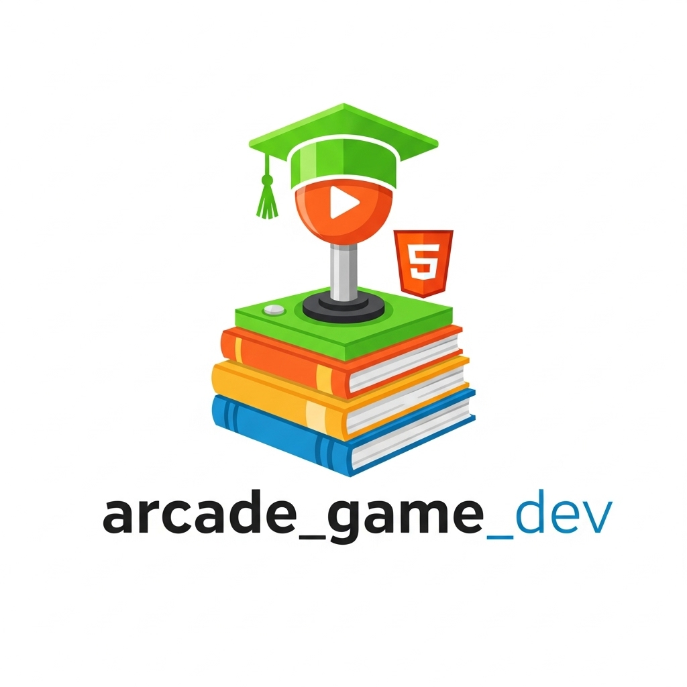

# arcade_game_dev 🎓

<div align="center">
  
  
  <h2>🎮 AI-Powered Educational Game Development & Web Deployment</h2>
  
  [](https://pypi.org/project/arcade_game_dev)
  [](https://python.org)
  [](https://api.arcade.academy)
  [](https://opensource.org/licenses/MIT)
</div>

**Educational-first AI game development with seamless web deployment.** Create accessible, educational games that run in browsers via Pyodide, with built-in learning analytics and accessibility features.

## 🌟 Why Arcade Game Dev?

- **🎓 Educational Focus**: Built-in learning objectives and progress tracking
- **🌐 Web-First**: Deploy instantly to browsers with Pyodide integration
- **♿ Accessibility Ready**: Screen reader support, keyboard navigation, color-blind friendly
- **📊 Learning Analytics**: Track student progress and engagement  
- **🎨 AI Asset Generation**: Educational-appropriate graphics and sounds
- **👩‍🏫 Teacher Tools**: Lesson plan integration and classroom management

## 🎯 Perfect For

- **Educational Institutions** - Math, science, and language learning games
- **Online Courses** - Interactive course content and assessments
- **Accessibility Training** - Games that teach inclusive design
- **Rapid Prototyping** - Quick game concepts for testing ideas
- **Web Applications** - Browser-based games without installation

## 📦 Installation

```bash
# Install from PyPI
pip install arcade_game_dev

# Install with web deployment features
pip install arcade_game_dev[web]

# Install with educational analytics
pip install arcade_game_dev[education]

# Install with accessibility features  
pip install arcade_game_dev[accessibility]

# Full installation
pip install arcade_game_dev[web,education,accessibility]
```

## 🚀 Quick Start

### Generate Educational Game

```python
from arcade_game_dev import create_educational_game, EducationalTemplate

# Create math learning game
math_game = create_educational_game(
    "Interactive fraction learning with visual pie charts",
    subject="mathematics",
    grade_level="4th",
    learning_objectives=[
        "Understand fraction concepts",
        "Compare fractions visually", 
        "Add and subtract fractions"
    ],
    template=EducationalTemplate.MATH_INTERACTIVE
)

# Run locally
math_game.run()

# Or deploy to web
math_game.deploy_to_web("./web_output/")
```

### Create Accessible Game

```python
from arcade_game_dev import create_accessible_game

accessible_game = create_accessible_game(
    "Color-matching puzzle with audio cues and high contrast mode",
    accessibility_features=[
        "screen_reader_support",
        "keyboard_navigation", 
        "high_contrast_mode",
        "audio_descriptions",
        "colorblind_friendly"
    ]
)
```

## 🎓 Educational Features

### Learning Objectives Integration

```python
from arcade_game_dev.education import LearningObjective, ProgressTracker

# Define learning objectives
objectives = [
    LearningObjective(
        id="fractions_basic",
        description="Identify fractions from visual representations",
        difficulty="beginner",
        subject="math"
    ),
    LearningObjective(
        id="fractions_compare", 
        description="Compare fraction sizes using visual aids",
        difficulty="intermediate",
        subject="math"
    )
]

# Track student progress
tracker = ProgressTracker(objectives)

# In game code
def on_correct_answer(question_type, difficulty):
    tracker.record_success(question_type, difficulty)
    
def on_incorrect_answer(question_type, difficulty, mistake_type):
    tracker.record_mistake(question_type, difficulty, mistake_type)
```

### Adaptive Difficulty

```python
from arcade_game_dev.education import AdaptiveDifficulty

# AI adjusts game difficulty based on student performance
adaptive = AdaptiveDifficulty(
    initial_level="grade_4",
    adjustment_sensitivity=0.7,
    min_level="grade_2",
    max_level="grade_6"
)

# Game automatically adjusts
current_difficulty = adaptive.get_current_level()
next_question = adaptive.generate_question(current_difficulty)

# Update based on performance
if student_answered_correctly:
    adaptive.record_success()
else:
    adaptive.record_failure()
```

### Assessment Integration

```python
from arcade_game_dev.education import AssessmentBuilder

# Create embedded assessments
assessment = AssessmentBuilder()
assessment.add_question(
    question="What fraction of the pie is colored blue?",
    question_type="visual_fraction",
    correct_answer="3/8", 
    visual_element="pie_chart_3_8_blue"
)

assessment.add_question(
    question="Which fraction is larger: 1/3 or 1/4?",
    question_type="comparison",
    correct_answer="1/3",
    explanation="1/3 represents larger pieces than 1/4"
)

# Generate assessment game
assessment_game = assessment.create_game(
    style="interactive_quiz",
    time_limit=300,  # 5 minutes
    randomize_questions=True
)
```

## 🌐 Web Deployment

### Pyodide Integration

```python
from arcade_game_dev.web import PyodideDeployer

# Deploy to web with Pyodide
deployer = PyodideDeployer()

web_game = deployer.create_web_build(
    game_module="math_fractions_game",
    title="Interactive Fraction Learning",
    description="Learn fractions through visual games",
    
    # Optimization for web
    optimize_assets=True,
    preload_assets=True,
    enable_offline_mode=True,
    
    # Educational features
    include_progress_tracking=True,
    enable_teacher_dashboard=True
)

# Custom HTML template
deployer.use_template("educational_game_template.html")
deployer.add_analytics("google_analytics_id")
```

### Progressive Web App (PWA)

```python
from arcade_game_dev.web import PWABuilder

# Create installable web app
pwa = PWABuilder()
pwa.set_manifest({
    "name": "Math Fraction Master",
    "short_name": "FractionMaster",
    "description": "Interactive fraction learning game",
    "start_url": "/",
    "display": "standalone",
    "background_color": "#ffffff",
    "theme_color": "#007bff",
    "orientation": "landscape"
})

pwa.add_offline_support([
    "assets/images/",
    "assets/sounds/", 
    "game.js",
    "manifest.json"
])

pwa.build(output_dir="./pwa_build/")
```

## ♿ Accessibility Features

### Screen Reader Support

```python
from arcade_game_dev.accessibility import ScreenReaderSupport

# Add comprehensive screen reader support
screen_reader = ScreenReaderSupport()

# Describe visual elements
screen_reader.describe_element(
    element_id="fraction_pie",
    description="Pie chart divided into 8 sections, 3 sections colored blue",
    context="math_problem"
)

# Announce game state changes
def on_score_change(new_score):
    screen_reader.announce(f"Score updated to {new_score} points")

def on_level_complete():
    screen_reader.announce("Level completed! Moving to next challenge.")
```

### Keyboard Navigation

```python
from arcade_game_dev.accessibility import KeyboardNavigation

# Full keyboard accessibility
keyboard_nav = KeyboardNavigation()

# Define navigation flow
keyboard_nav.add_focusable_element("start_button", position=(400, 300))
keyboard_nav.add_focusable_element("instructions_button", position=(400, 250))
keyboard_nav.add_focusable_element("settings_button", position=(400, 200))

# Custom key bindings
keyboard_nav.bind_key("ENTER", "activate_focused_element")
keyboard_nav.bind_key("SPACE", "activate_focused_element") 
keyboard_nav.bind_key("TAB", "focus_next_element")
keyboard_nav.bind_key("SHIFT+TAB", "focus_previous_element")
```

### High Contrast Mode

```python
from arcade_game_dev.accessibility import HighContrastMode

# Accessibility-compliant color schemes
high_contrast = HighContrastMode()

# Define accessible color palettes
high_contrast.add_palette("default", {
    "background": "#000000",
    "foreground": "#ffffff", 
    "accent": "#ffff00",
    "success": "#00ff00",
    "error": "#ff0000"
})

high_contrast.add_palette("colorblind_friendly", {
    "background": "#ffffff",
    "foreground": "#000000",
    "accent": "#0066cc",  # Blue instead of red/green
    "success": "#0066cc",
    "error": "#ff6600"    # Orange instead of red
})

# Apply based on user preference
def toggle_high_contrast():
    if high_contrast.is_enabled():
        high_contrast.disable()
    else:
        high_contrast.enable("colorblind_friendly")
```

## 🎨 Educational Asset Generation

### Subject-Specific Graphics

```python
from arcade_game_dev.assets import generate_educational_assets

# Math-specific assets
math_assets = generate_educational_assets(
    subject="mathematics",
    topics=["fractions", "geometry", "algebra"],
    grade_level="elementary",
    style="friendly_cartoon",
    assets=[
        "fraction_circles",
        "geometric_shapes", 
        "number_lines",
        "coordinate_grids",
        "measurement_tools"
    ]
)

# Science assets  
science_assets = generate_educational_assets(
    subject="science", 
    topics=["solar_system", "plants", "weather"],
    grade_level="middle_school",
    style="scientific_illustration",
    assets=[
        "planet_models",
        "plant_lifecycle",
        "weather_icons",
        "laboratory_equipment"
    ]
)
```

### Interactive Learning Elements

```python
from arcade_game_dev.interactive import create_interactive_element

# Drag-and-drop fraction builder
fraction_builder = create_interactive_element(
    type="drag_and_drop",
    description="Interactive fraction visualization tool",
    components=[
        "draggable_numerator",
        "draggable_denominator", 
        "visual_fraction_display",
        "equivalent_fraction_hint"
    ],
    validation_rules=[
        "numerator_must_be_positive",
        "denominator_cannot_be_zero",
        "display_simplified_form"
    ]
)

# Virtual lab experiment
chemistry_lab = create_interactive_element(
    type="virtual_experiment",
    description="Safe virtual chemistry lab for acid-base reactions",
    equipment=["beakers", "ph_strips", "droppers", "safety_goggles"],
    safety_checks=True,
    real_time_feedback=True
)
```

## 📊 Learning Analytics

### Progress Tracking

```python
from arcade_game_dev.analytics import LearningAnalytics

# Comprehensive learning analytics
analytics = LearningAnalytics()

# Track detailed student interactions
analytics.track_event("question_answered", {
    "question_id": "frac_001",
    "student_answer": "3/8",
    "correct_answer": "3/8", 
    "time_taken": 15.2,  # seconds
    "attempts": 1,
    "hint_used": False
})

analytics.track_event("misconception_identified", {
    "concept": "fraction_comparison",
    "misconception_type": "larger_denominator_means_larger_fraction",
    "intervention": "visual_pie_chart_comparison"
})

# Generate reports
daily_report = analytics.generate_daily_report(student_id="student_123")
class_summary = analytics.generate_class_summary(class_id="math_4a")
```

### Teacher Dashboard

```python
from arcade_game_dev.teacher import TeacherDashboard

# Real-time classroom monitoring
dashboard = TeacherDashboard()

# Monitor student progress
dashboard.add_student_monitor("jane_doe", {
    "current_level": "fractions_intermediate",
    "time_played": 45,  # minutes
    "accuracy": 0.87,
    "common_mistakes": ["decimal_confusion", "improper_fractions"],
    "needs_help": False
})

# Classroom-wide insights
dashboard.show_class_overview([
    "average_completion_time",
    "common_misconceptions", 
    "students_needing_help",
    "engagement_metrics"
])

# Intervention recommendations
interventions = dashboard.get_intervention_suggestions()
```

## 🎮 Game Templates

### Educational Game Types

```python
from arcade_game_dev.templates import (
    MathGameTemplate,
    ScienceLabTemplate, 
    LanguageArtsTemplate,
    HistoryTimelineTemplate
)

# Math game templates
fraction_game = MathGameTemplate.FRACTION_VISUALIZATION.create_game(
    "Interactive fraction learning with pizza slices",
    difficulty_progression=True,
    visual_feedback=True,
    assessment_integration=True
)

# Science simulation
physics_sim = ScienceLabTemplate.PHYSICS_SIMULATION.create_game(
    "Projectile motion experiment with adjustable parameters",
    real_world_data=True,
    safety_simulation=True,
    hypothesis_testing=True
)

# Language learning
vocabulary_game = LanguageArtsTemplate.VOCABULARY_BUILDER.create_game(
    "Context-based vocabulary learning with story elements",
    adaptive_difficulty=True,
    pronunciation_practice=True,
    cultural_context=True
)
```

## 🌐 Deployment Examples

### School Website Integration

```python
from arcade_game_dev.deployment import SchoolIntegration

# Integrate with Learning Management Systems
lms_integration = SchoolIntegration()

# Google Classroom integration
lms_integration.connect_google_classroom(
    course_id="math_grade_4_2024",
    assignment_title="Fraction Master Game",
    due_date="2024-02-15",
    points=10
)

# Canvas LMS integration  
lms_integration.connect_canvas(
    course_id=12345,
    assignment_group="Interactive Activities",
    grading_type="points"
)
```

### Standalone Web Deployment

```bash
# Deploy to any web server
arcade-deploy-web my_math_game.py --output ./web_build/
cd web_build
python -m http.server 8000

# Deploy to GitHub Pages
arcade-deploy-web my_math_game.py --github-pages --repo username/math-game

# Deploy to educational platforms
arcade-deploy-web my_math_game.py --platform khan-academy
arcade-deploy-web my_math_game.py --platform scratch-for-educators
```

## 🧪 Testing Educational Content

```python
from arcade_game_dev.testing import EducationalTester

# Test educational effectiveness
tester = EducationalTester()

# Validate learning objectives
tester.test_learning_objectives(
    game=fraction_game,
    expected_outcomes=[
        "students_can_identify_fractions",
        "students_can_compare_fractions", 
        "students_understand_equivalent_fractions"
    ]
)

# Accessibility compliance testing
accessibility_results = tester.test_accessibility_compliance([
    "wcag_2.1_aa",
    "section_508",
    "aria_standards"
])

# Age-appropriate content validation
content_rating = tester.validate_age_appropriate_content(
    target_age_range="8-12",
    content_categories=["educational", "safe", "engaging"]
)
```

## 📚 Examples

Explore educational game examples:

- **[Math Fraction Master](examples/math_fractions/)** - Interactive fraction learning
- **[Science Lab Simulator](examples/science_lab/)** - Virtual chemistry experiments  
- **[Geography Explorer](examples/geography/)** - World geography with cultural context
- **[Language Learning Adventure](examples/language_learning/)** - Story-based vocabulary building
- **[History Timeline Game](examples/history_timeline/)** - Interactive historical events

## 🤝 Contributing

Help make educational gaming more accessible and effective!

1. Fork the repository
2. Create feature branch: `git checkout -b feature/educational-improvement`
3. Run tests: `python -m pytest tests/education/`
4. Test accessibility: `python -m pytest tests/accessibility/`
5. Submit pull request

### Educational Content Guidelines

When contributing educational content:
- Follow age-appropriate design principles
- Ensure accessibility compliance (WCAG 2.1 AA)
- Include learning objective mapping
- Test with actual students when possible
- Provide teacher guidance materials

## 📄 License

Licensed under the MIT License. See [LICENSE](LICENSE) for details.

## 🔗 Links

- **[PyPI Package](https://pypi.org/project/arcade_game_dev)** - Official package
- **[Documentation](https://arcade-game-dev.readthedocs.io)** - Full documentation  
- **[GitHub](https://github.com/ai-game-dev/arcade_game_dev)** - Source code
- **[Examples](examples/)** - Educational game examples
- **[Python Arcade](https://api.arcade.academy)** - Core game library
- **[Teacher Resources](https://arcade-game-dev.readthedocs.io/teachers/)** - Classroom guides

---

<div align="center">
  <strong>🎓 Making learning engaging and accessible for everyone</strong>
</div>