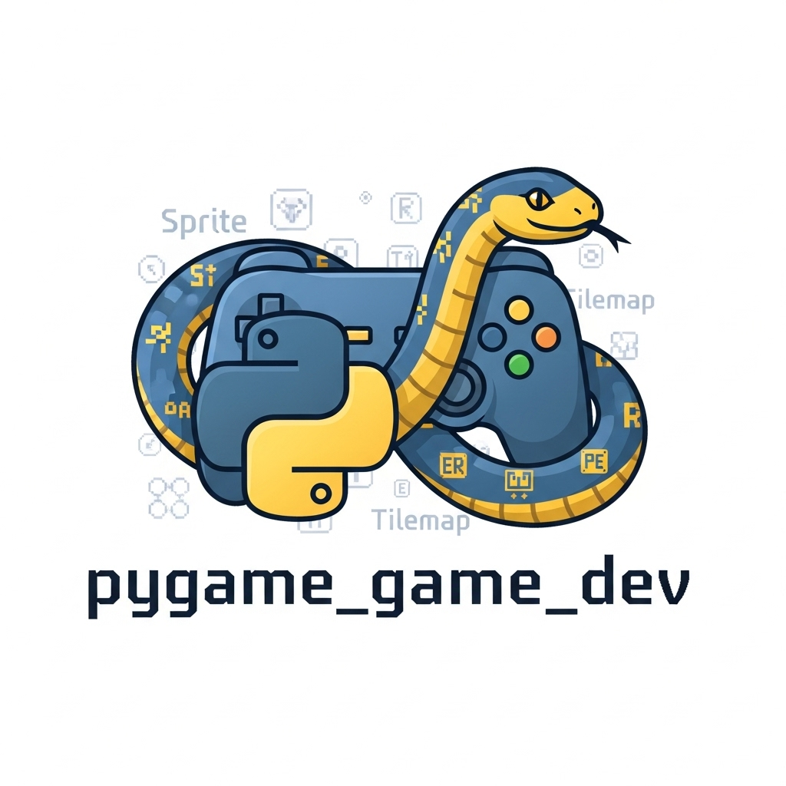

# pygame_game_dev 🐍

<div align="center">
  
  
  <h2>🎮 AI-Powered 2D Game Development with PyGame</h2>
  
  [](https://pypi.org/project/pygame_game_dev)
  [](https://python.org)
  [](https://pygame.org)
  [](https://opensource.org/licenses/MIT)
</div>

**Specialized AI-powered 2D game development built on the robust PyGame foundation.** Create pixel-perfect games with intelligent sprite generation, advanced 2D physics, and seamless PyGame integration.

## 🌟 Why PyGame Game Dev?

- **🎨 Intelligent 2D Asset Creation**: AI generates sprites, tilesets, and animations
- **🔄 Advanced Animation System**: Frame-based and skeletal animation support  
- **⚡ Optimized 2D Physics**: Pymunk integration for realistic 2D physics
- **🗺️ Tilemap Intelligence**: AI creates tile-based worlds and level layouts
- **🎵 Smart Audio**: Dynamic music and sound effect generation
- **📱 Cross-Platform**: Desktop, mobile, and web deployment ready

## 🎯 Perfect For

- **Classic 2D Platformers** - Mario-style jumping and collision detection
- **Top-Down Adventures** - Zelda-inspired exploration games  
- **Puzzle Games** - Tetris, match-3, and logic-based challenges
- **Retro Arcade Games** - Pac-Man, Space Invaders, and classic revivals
- **Educational Games** - Interactive learning with 2D graphics

## 📦 Installation

```bash
# Install from PyPI
pip install pygame_game_dev

# Install with optional features
pip install pygame_game_dev[physics,tiles,audio]

# Development installation
pip install pygame_game_dev[dev]
```

## 🚀 Quick Start

### Generate Your First 2D Game

```python
import pygame
from pygame_game_dev import create_2d_game, PlatformerTemplate

# Create a complete platformer in seconds
game = create_2d_game(
    "2D platformer with coins, enemies, and power-ups",
    template=PlatformerTemplate(),
    screen_size=(800, 600),
    target_fps=60
)

# Run the game
game.run()
```

### Generate Custom Sprites

```python
from pygame_game_dev import SpriteGenerator, generate_sprite_sheet

# Generate player character sprites
player_sprites = generate_sprite_sheet(
    "Heroic knight character with sword and shield",
    animations=["idle", "walk", "jump", "attack"],
    frame_count=8,
    sprite_size=(64, 64),
    style="pixel_art"
)

# Load into PyGame
player_surface = pygame.image.load(player_sprites.path)
```

## 🎨 AI Asset Generation

### Sprite Generation

Create professional 2D sprites with AI:

```python
from pygame_game_dev.assets import generate_sprite_sheet

# Character sprites
hero_sprites = generate_sprite_sheet(
    description="Medieval knight with blue armor",
    animations={
        "idle": 4,      # 4 frames
        "walk": 8,      # 8 frames  
        "attack": 6,    # 6 frames
        "jump": 3       # 3 frames
    },
    size=(48, 48),
    style="pixel_art"
)

# Enemy sprites
enemy_sprites = generate_sprite_sheet(
    description="Green goblin with club weapon",
    animations=["walk", "attack", "hurt", "death"],
    size=(32, 32),
    style="pixel_art"
)
```

### Tileset Generation

Generate complete tilesets for your levels:

```python
from pygame_game_dev.tiles import generate_tile_set

# Generate platformer tileset
tileset = generate_tile_set(
    description="Grassy hills with stone platforms and background trees",
    tile_size=(32, 32),
    tileset_size=(16, 16),  # 16x16 tiles
    style="pixel_art",
    features=["collision", "animated_grass", "parallax_background"]
)

# Use with tilemap
from pygame_game_dev import TileMap
tilemap = TileMap.from_tileset(tileset, level_data)
```

### UI Element Generation

Create consistent UI elements:

```python
from pygame_game_dev.ui import generate_ui_elements

ui_pack = generate_ui_elements(
    description="Medieval fantasy UI with wooden buttons and stone panels",
    elements=[
        "button_normal", "button_hover", "button_pressed",
        "panel_background", "health_bar", "mana_bar",
        "inventory_slot", "dialog_box"
    ],
    style="fantasy"
)
```

## 🔄 Advanced Animation System

### Frame-Based Animation

```python
from pygame_game_dev.animation import SpriteAnimator

class Player(pygame.sprite.Sprite):
    def __init__(self):
        super().__init__()
        self.animator = SpriteAnimator(hero_sprites)
        
        # Define animations
        self.animator.add_animation("idle", frames=[0, 1, 2, 3], fps=8)
        self.animator.add_animation("walk", frames=[4, 5, 6, 7, 8, 9, 10, 11], fps=12)
        self.animator.add_animation("jump", frames=[12, 13, 14], fps=15)
        
        # Start with idle
        self.animator.play("idle", loop=True)
    
    def update(self, dt):
        self.animator.update(dt)
        self.image = self.animator.current_frame
```

### Skeletal Animation Support

```python
from pygame_game_dev.animation import SkeletalAnimator

# For more complex character animation
skeletal_animator = SkeletalAnimator(
    bones=["torso", "head", "arm_left", "arm_right", "leg_left", "leg_right"],
    sprite_parts=character_parts
)

# AI generates smooth interpolated animations
skeletal_animator.create_animation("walk_cycle", duration=1.0)
```

## ⚡ Physics Integration

### 2D Physics with Pymunk

```python
from pygame_game_dev.physics import PhysicsWorld, PhysicsBody

# Create physics world
physics = PhysicsWorld(gravity=(0, -981))  # Earth gravity

# Create physics bodies
ground = PhysicsBody.create_static_box(
    position=(400, 50),
    size=(800, 100),
    friction=0.7
)

player = PhysicsBody.create_dynamic_circle(
    position=(100, 300),
    radius=20,
    mass=1.0
)

# Add to world
physics.add_body(ground)
physics.add_body(player)

# Update in game loop
def update(dt):
    physics.step(dt)
    
    # Sync sprite positions with physics
    player_sprite.rect.center = player.position
```

### Collision Detection

```python
from pygame_game_dev.physics import CollisionManager

collision_manager = CollisionManager()

# Define collision groups
collision_manager.add_group("player", collision_type=1)
collision_manager.add_group("enemies", collision_type=2)  
collision_manager.add_group("collectibles", collision_type=3)

# Handle collisions
@collision_manager.on_collision("player", "enemies")
def player_enemy_collision(player_body, enemy_body):
    player.take_damage(10)
    enemy_body.destroy()

@collision_manager.on_collision("player", "collectibles")  
def player_collectible_collision(player_body, collectible_body):
    player.add_score(100)
    collectible_body.destroy()
```

## 🗺️ Tilemap System

### AI-Generated Levels

```python
from pygame_game_dev.tiles import TileMap, generate_level

# Generate complete level layout
level_data = generate_level(
    description="Platformer level with moving platforms, spikes, and secret areas",
    size=(100, 20),  # 100x20 tiles
    difficulty="intermediate",
    features=["moving_platforms", "hazards", "secrets", "checkpoints"]
)

# Create tilemap
tilemap = TileMap(
    tileset=tileset,
    level_data=level_data,
    tile_size=(32, 32)
)

# Render in game
def render(screen):
    tilemap.draw(screen, camera_offset)
```

### Parallax Backgrounds

```python
from pygame_game_dev.tiles import ParallaxBackground

# AI generates layered backgrounds
background = ParallaxBackground.generate(
    description="Mountain landscape with clouds and distant castle",
    layers=5,
    screen_size=(800, 600)
)

# Update with camera movement
def update_background(camera_velocity):
    background.update(camera_velocity, scroll_factors=[0.1, 0.3, 0.5, 0.7, 0.9])
```

## 🎵 Audio System

### Dynamic Music Generation

```python
from pygame_game_dev.audio import SoundManager, generate_music

# Generate adaptive music
music_manager = SoundManager()

# AI creates music that adapts to gameplay
background_music = generate_music(
    description="Upbeat chiptune adventure music",
    style="8bit",
    duration=120,  # 2 minutes, loops seamlessly
    adaptive=True  # Changes based on game state
)

music_manager.play_music(background_music, volume=0.7)

# Dynamic music adaptation
def on_boss_fight():
    music_manager.transition_to_intense()

def on_peaceful_area():
    music_manager.transition_to_ambient()
```

### Sound Effect Generation

```python
from pygame_game_dev.audio import generate_sound_effects

# Generate consistent sound pack
sounds = generate_sound_effects([
    "jump_sound",
    "coin_collect", 
    "enemy_defeat",
    "power_up",
    "footstep_grass",
    "door_open",
    "explosion_small"
], style="retro_arcade")

# Use in game
def player_jump():
    sounds["jump_sound"].play()
```

## 🎮 Game Templates

### Pre-built Game Types

```python
from pygame_game_dev.templates import (
    PlatformerTemplate,
    TopDownTemplate,
    PuzzleTemplate
)

# Platformer game
platformer = create_2d_game(
    "Mario-style platformer with multiple worlds",
    template=PlatformerTemplate(
        physics_enabled=True,
        moving_platforms=True,
        power_ups=True
    )
)

# Top-down adventure
adventure = create_2d_game(
    "Zelda-style adventure with dungeons and items", 
    template=TopDownTemplate(
        inventory_system=True,
        dialog_system=True,
        save_system=True
    )
)

# Puzzle game
puzzle = create_2d_game(
    "Match-3 puzzle with special effects",
    template=PuzzleTemplate(
        grid_size=(8, 8),
        match_count=3,
        special_pieces=True
    )
)
```

## 📱 Deployment Options

### Desktop Distribution

```python
from pygame_game_dev.deployment import create_desktop_build

# Create standalone executable
create_desktop_build(
    game_module="my_game",
    platforms=["windows", "mac", "linux"],
    icon="game_icon.ico",
    include_data=["assets/", "levels/"]
)
```

### Web Deployment

```python
from pygame_game_dev.deployment import deploy_to_web

# Deploy to web using Pyodide
deploy_to_web(
    game_module="my_game",
    output_dir="web_build/",
    optimize_for_web=True,
    preload_assets=True
)
```

## 📊 Performance Optimization

### Sprite Batching

```python
from pygame_game_dev.optimization import SpriteBatcher

# Batch similar sprites for better performance
batcher = SpriteBatcher()

# Add sprites to batches
batcher.add_sprite("enemies", enemy_sprite, position)
batcher.add_sprite("coins", coin_sprite, position)
batcher.add_sprite("backgrounds", bg_sprite, position)

# Render all batches efficiently
def render(screen):
    batcher.draw_all(screen, camera_offset)
```

### Efficient Collision Detection

```python
from pygame_game_dev.optimization import SpatialHash

# Use spatial hashing for large numbers of objects
spatial_hash = SpatialHash(cell_size=64)

# Update object positions
for sprite in all_sprites:
    spatial_hash.update_object(sprite, sprite.rect)

# Efficient collision queries
nearby_enemies = spatial_hash.query_region(player.rect.inflate(100, 100))
```

## 🧪 Testing Your Games

```python
from pygame_game_dev.testing import GameTester

# Automated game testing
tester = GameTester(your_game)

# Test basic functionality
tester.test_player_movement()
tester.test_collision_detection() 
tester.test_level_completion()
tester.test_save_load_system()

# Performance testing
performance = tester.benchmark_performance(duration=60)  # 60 seconds
print(f"Average FPS: {performance.avg_fps}")
print(f"Memory usage: {performance.memory_usage}MB")
```

## 📚 Examples

Check out our comprehensive examples:

- **[Platformer](examples/platformer/)** - Complete Mario-style game
- **[Top-Down Shooter](examples/top_down_shooter/)** - Arcade-style action
- **[Puzzle Game](examples/puzzle_game/)** - Match-3 with animations
- **[RPG Demo](examples/rpg_demo/)** - Character progression and dialog
- **[Physics Playground](examples/physics_demo/)** - Advanced physics simulation

## 🤝 Contributing

Help make PyGame AI game development even better!

1. Fork the repository
2. Create feature branch: `git checkout -b feature/awesome-feature`
3. Run tests: `python -m pytest`
4. Submit pull request

### Development Setup

```bash
git clone https://github.com/ai-game-dev/pygame_game_dev
cd pygame_game_dev
pip install -e .[dev]
python -m pytest
```

## 📄 License

Licensed under the MIT License. See [LICENSE](LICENSE) for details.

## 🔗 Links

- **[PyPI Package](https://pypi.org/project/pygame_game_dev)** - Official package
- **[Documentation](https://pygame-game-dev.readthedocs.io)** - Full documentation
- **[GitHub](https://github.com/ai-game-dev/pygame_game_dev)** - Source code
- **[Examples](examples/)** - Complete game examples
- **[PyGame](https://pygame.org)** - Core game library

---

<div align="center">
  <strong>🐍 AI-powered 2D game development made simple</strong>
</div>